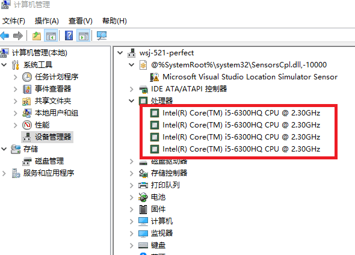
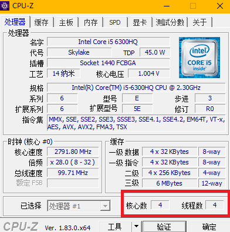
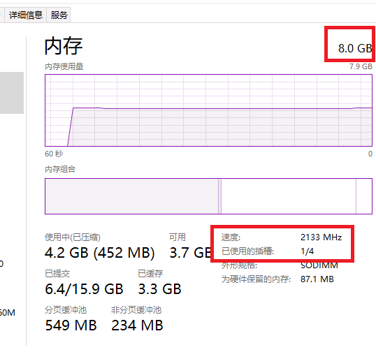
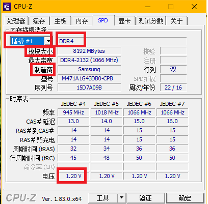
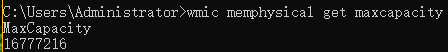
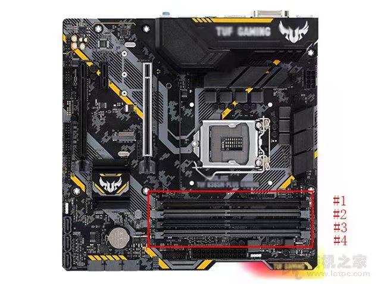
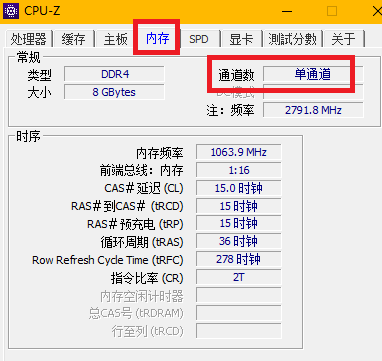

# 查看系统信息

## CPU 内核/线程信息

- 方式一：

  - 这里可以看到是4个线程

  ​       

  - 从任务管理器可以同时看到内核数和线程数

  ​         


- 方式二：CPU-Z工具：

   


---

## 内存信息

> 内存信息主要看容量，最大支持容量，插槽数，代数（类型），频率（速度），制造商

- 方式一：任务管理器（容量、插槽、频率）

   

- 方式二：CPU-Z（除最大容量外所有信息）

  > SPD是内存模组上面的一个可擦写的eeprom，里面记录了该内存的许多重要信息
  >
  > 内存的类型可以看到是DDR4，其次也可通过电压1.20v来验证确实为DDR4，通过电压来看内存的类型是最准确的

   


- 最大容量 （cmd）

  ```shell
  wmic memphysical get maxcapacity
  ```

   

  用这个数字除以1024两次所得即为系统支持的最大内容容量


### 内存安装相关

在查清计算机已经配置的内存后，需要在网上购买内存条：搜索：笔记本内存 DDR4 8G 2133 即可

购买的内存条频率和类型要和自带的相同，这样可以插上后组件的双通道才可以展示出最高的性能

关于双通道：

> ​		如果一款主板支持内存双通道，说明主板的北桥芯片中设计了两个内存控制器，而这两个内存控制器可以互相独立地工作，每一个内存控制器控制一个内存通道，所以CPU可以对两个内存分别寻址，能够为内存带来双倍的内存带宽，为CPU提供更高的数据带宽，对内存数据进行频繁交换的软件得到较大的优势

- 如果主板上只有两个插槽，则将内存条插入另一个插槽即可自动构建双通道

- 如果主板上有4个插槽，则1 3插槽可以匹配成双通道，2 4插槽可以匹配成双通道

   

- 8g+8g的双通道性能一般来讲大于一根16g的内存

- 双通道内存可以不同，例如：DDR4 8G + DDR4 4G

- 双通道内存可以不同品牌

- 双通道内存可以不同频率

  - 但是最高频率的那条内存会自动降频至最低的那根频率上；但是必须同代，例如都是DDR4

- 安装好内存后，查看是否是双通道（CPU-Z）

   


