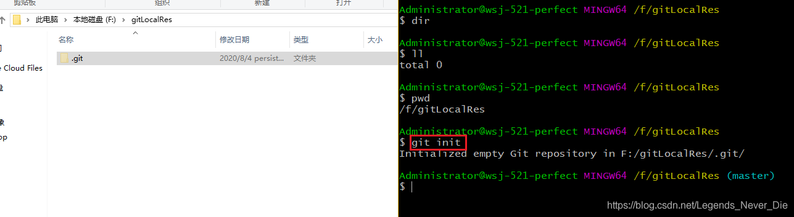

> 在进行代码提交相关操作前，需要**建立本地仓库+设置签名**

## 建立本地仓库

> 命令：git init
>
> 注：git为主命令，init为子命令

## 设置签名

### 相关简介

> 作用：区分不同开发人员的身份
>
> 形式：用户名：wsj ，Email地址：goodMorning@163.com
> **注：Email地址可以不存在，只是为了区分身份，不会发邮件**
>
> 辨析：这里设置的签名和登录远程库（代码托管中心）的账号、密码没有任何关系

### 相关命令及级别划分

**项目/仓库级别命令：仅在当前本地库范围内有效**

> git config user.name wsj_pro
>
> git config user.email wsj_pro@163.com

**系统用户级别命令（推荐）：登录当前OS的用户范围**

> git config --global user.name wsj_pro
>
> git config --global user.email wsj_pro@163.com

**级别优先级**

> 就近原则：项目级别优先于系统用户级别，二者都有时采用项目级别签名
>
> 如果只有系统用户级别签名，则使用系统用户级别签名
>
> 二者没有不允许

### 签名的保存位置

项目级别签名：当前本地仓库目录.git下的config文件

系统用户级别签名：当前OS用户文档目录，C:\Users\Administrator