## 状态查看操作

> 查看工作区、暂存区的状态：**git status**
>
> 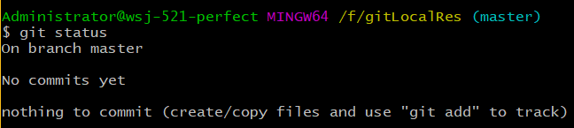
>
> **本地库目录下的文件最原始都处于工作区之中，将其添加到暂存区，Git才会对其进行追踪**

## 添加操作

> 将工作区的“新建/修改”添加到暂存区：**git add [fileName]**
>
> 该命令用于Git追踪文件
>
> 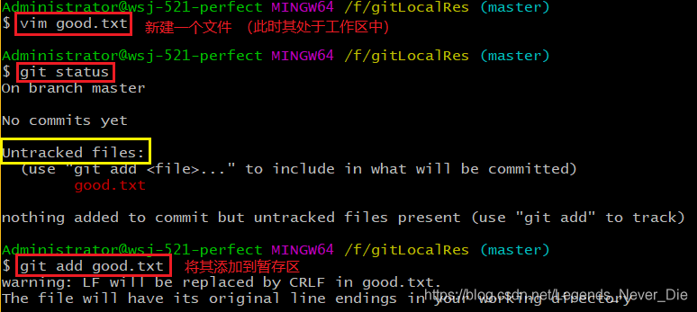
>
> 此时，再次查看状态：
>
> 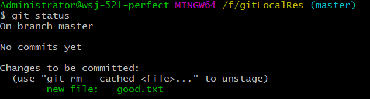

 

## 恢复操作

> 使用暂时区的内容恢复工作区的内容，放弃工作区的更改
>
> git checkout -- 文件名

## 提交操作

> 将暂存区的内容提交到本地库：**git commit -m "commit message" [fileName]**
>
> 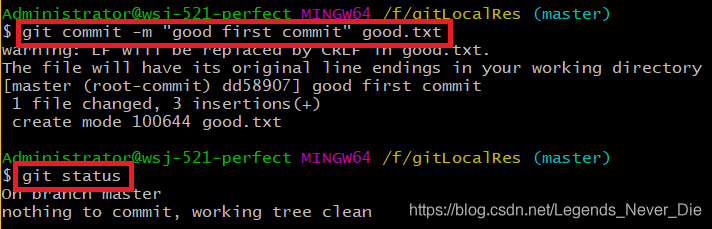

### 补充

> 如果某个文件已被追踪过，若对其再次修改，可以直接`git commit -am 'msg'`将所有追踪的且发生变化的文件一次性提交

## 推送操作

- 本地库与远程库建立联系

  使用SSH登录（这样不用每次提交输入账号密码）

  - 进入当前用户家目录 `cd ~`

  - 删除之前产生的.ssh目录 `rm -rvf .ssh`

  - 产生.ssh密钥目录`ssh-keygen -t rsa -C 登陆邮箱`

  - 进入.ssh目录查看文件列表 `cd .ssh`     `ls -a`

  - 查看id_rsa.pub文件内容并复制 `cat id_rsa.pub`

  - 登录GitHub -> 点击头像 -> Settings -> SSH and GPGkeys -> New SSH Key -> 粘贴复制的密钥信息到内容区，题目随意

  - 回到Git Bash创建远程地址别名

    `git remote add origin_ssh 远程库ssh地址`

- 推送文件`git push origin_ssh master`

  > 该命令作用是将本地的master分支推送到origin主机的master分支

### 其他

> - 查看远程仓库别名：`git remote -v`
>
> - 删除远程仓库别名：`git remote rm 别名`
>
> git push完整格式：git push <远程主机名> <本地分支名>:<远程分支名>
>
> - 如果省略远程分支名，则表示将本地分支推送到与之存在==追踪关系==的远程分支(通常同名)，如果远程分支不存在，则会被创建
>   - 追踪分支：在Git中追踪分支是用来联系本地分支和远程分支的。如果在追踪分支上执行push或者pull时，他会自动推动或拉取到关联的远程分支上
>     - 如果经常从远程仓库拉取分支到本地，并且不想很麻烦的使用`git pull`这种形式，那么就应当使用追踪分支
>     - 查看本地分支及追踪的分支：`git branch -vv`
>     - 建立追踪分支：
>       1.  `git branch --set-upstream-to=<远程主机名>/<远程分支名> <本地分支名>`
>       2. 第一次推送加上`-u`参数：`git push -u origin master`,这样本地分支就和服务器同名分支产生追踪关系
> - 如果当前分支和远程分支都存在追踪关系，则本地分支和远程分支都可以省略：`git push origin_ssh`
> - 如果当前分支只有一个追踪分支，那么主机名都可省略：`git push`
> - 如果当前分支与多个主机存在追踪关系，则可使用`-u`指定一个默认主机，这样下次推送就可以直接使用git push： `git push -u origin_ssh master`

## 查看历史版本

> 1、**git log**
>
> 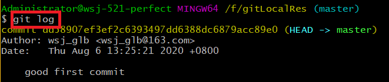
>
> 多屏显示控制方式：space 向下翻页，b 向上翻页，q 退出
>
> 2、信息简要显示：**git log --pretty=oneline**
>
> 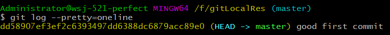
>
> 3、信息简要显示：**git log --online**
>
> 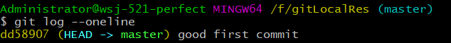
>
> **注：上图中的字符串dd56807xxx是HEAD指针所指向的当前历史版本的系统快照的哈希索引值，该索引的局部表示（这里是前7位）常用来进行版本之间的切换**
>
> 4、**git reflog**(**常用****)**   **注：以上三种方式只能看到当前版本之前的历史，而该方式可以看到所有历史版本**
>
> 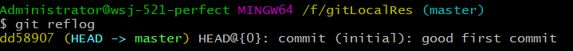
>
> HEAD@{移动到当前版本需要多少步}

## 版本的前进后退

> 版本前进后退的本质：每个版本都是以快照的形式存在，Git通过对HEAD指针的移动对版本进行控制
>
> **方式：**
>
> 1、基于hash局部索引值操作[推荐]：**git reset --hard [目标版本的局部索引值]**
>
> 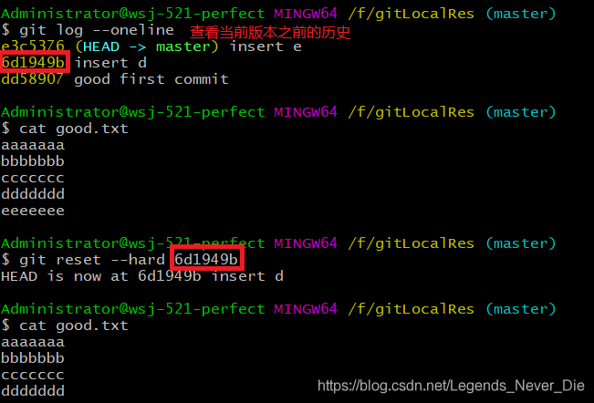
>
> 2、使用^，（只能后退）：**git reset --hard HEAD^**
> **注：如果没有^，表示回退到当前版本；一个表示后退一步，n个表示后退n步**
>
> 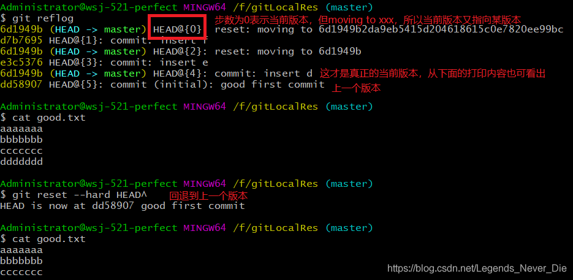
>
> 3、使用~，（只能后退）：**git reset --hard HEAD~n**
>
> **注：表示后退n步**，第2种方式的简化

## **删除文件并找回**

> 前提：删除前，文件存在时的状态提交到了本地库
>
> 操作：使用历史版本进行回退即可

## 分支管理

### 什么是分支

> 在版本控制中，使用多条线路同时推进多个任务，每条线路就是一个分支
>
> 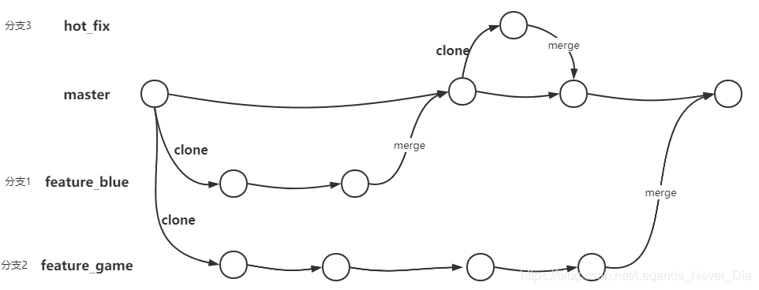

### 分支的好处

> 1、可以同时并行推进多个功能开发、提高工作效率
>
> 2、各个分支在开发过程中，如果某一个分支开发失败，不会对其他分支有任何影响，失败的分支删除重新开始即可

### 分支操作

> 创建分支：**git branch [分支名]**
>
> 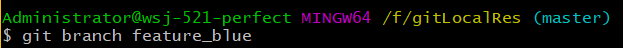
>
> 查看分支：**git branch -v**
>
> 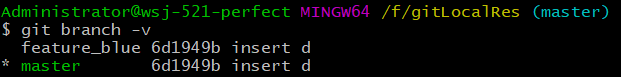
>
> 切换分支：**git checkout [分支名]**
>
> ****
>
> **合并分支+解决冲突(可能会出现)：**
> 第一步：切换到接受修改的分支(一般为master)：git checkout [被合并分支名]
>
> 第二步：执行merge命令：git merge [有新内容的分支名]
>
> 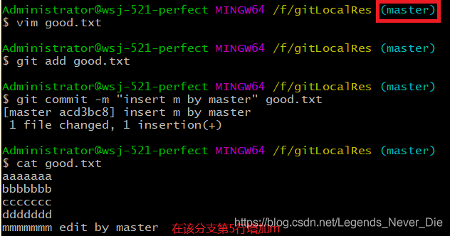
>
> 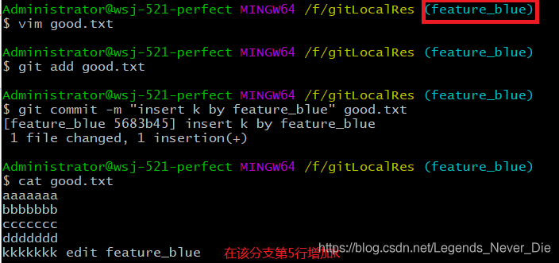
>
> **Git是按行为单位进行比对，所以再将feature_blue合并到master上时会发生冲突**
>
> 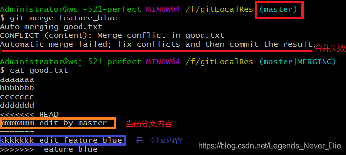
>
> **冲突的解决：**
>
> 第一步：编辑文件，删除特殊符号
>
> 第二部：把文件修改到满意的程度，保存退出
>
> 第三步：git add [fileName]
>
> **第四步：git commit -m "日志信息"** 
>
> **注：第四步提交到本地库时不带文件名**

### Git分支机制

> **其实就是指针的创建和移动**
>
> **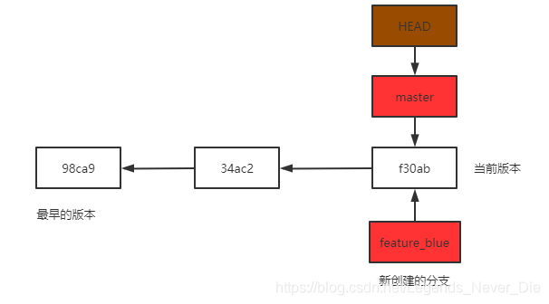**
>
> **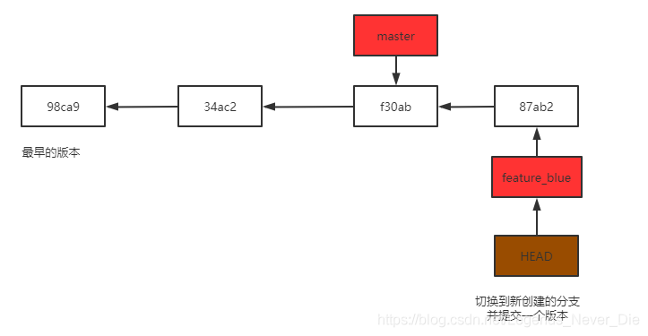**
>
> ****

---

## 同步/拉取

> 建议每次写代码前，先同步服务器上该分支的最新数据到本地
>
> 1、切换到该分支：git checkout 分支名
>
> 2、如果拉取的分支与当前分支存在追踪关系：git pull
>
> - pull = fetch + merge
> - git fetch [远程地址库别名] [远程分支名]
> - git merge [远程地址库别命/远程分支名] 
> - git pull [远程地址库别名] [远程分支名]

