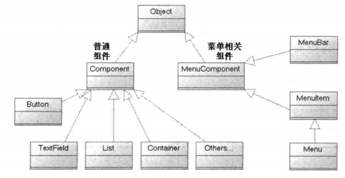
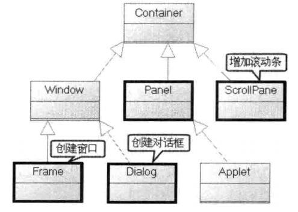
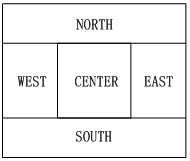
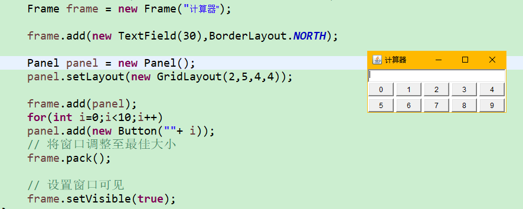
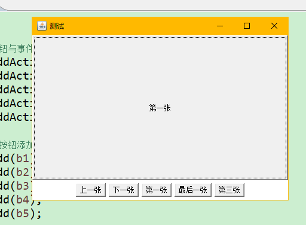
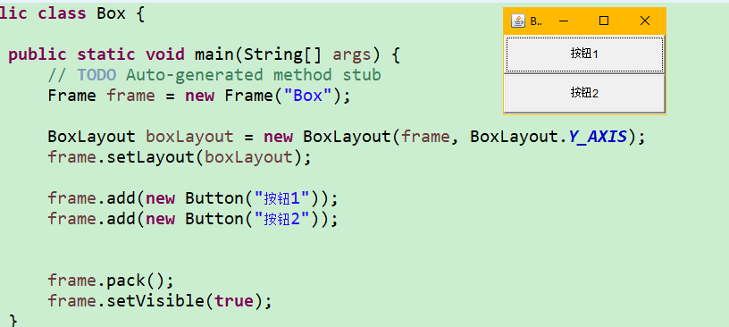
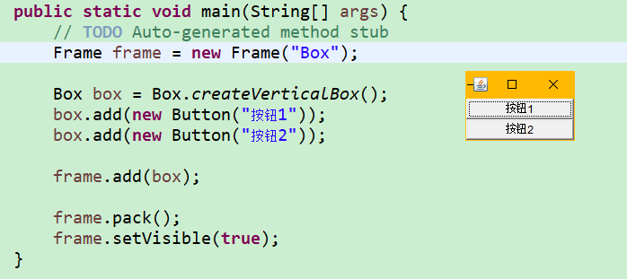
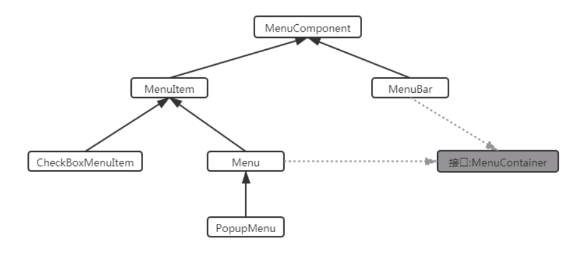

# AWT图像界面编程

## 继承体系

 

 

> - Window是可以独立存在的顶级窗口，默认使用`BorderLayout`管理其内部组建布局
> - Panel可以容纳其他组件，但不能独立存在，他必须内嵌其他容器中使用，默认使用`FlowLayout`管理其内部组建布局
> - ScrollPane是一个带滚动条的容器，他也不能独立存在，默认使用`BorderLayout`管理其内部组建布局


## 常用API

Component作为基类，提供了如下常用的方法来设置组件的大小，位置，可见性等

|                    方法                     |           功能           |
| :-----------------------------------------: | :----------------------: |
|          setLocation(int x, int y)          |      设置组件的位置      |
|       setSize(int width, int height)        |      设置组件的大小      |
| setBounds(int x,int y,int width,int height) | 同时设置组件的位置和大小 |
|            setVisible(Boolean b)            |     设置组件的可见性     |


Container作为容器根类，提供了如下的方法来访问容器中的组件

|                方法                 |                             功能                             |
| :---------------------------------: | :----------------------------------------------------------: |
|    Component add(Component comp)    | 向容器中添加其他组件(该组件既可以是普通组件，也可以是容器)，并返回被添加的组件 |
| Component getComponent(int x,int y) |                        返回指定的组件                        |
|       int getComponentCont()        |                    返回该容器内组件的数量                    |
|     Component[] getComponents()     |                    返回该容器内所有的组件                    |

示例程序1：

```java
public static void main(String[] args) {
    // TODO Auto-generated method stub
    // 创建窗口
    Frame frame = new Frame("测试程序");

    // 设置窗口位置和大小
    frame.setLocation(100, 100);
    frame.setSize(400, 400);

    // 设置窗口可见
    frame.setVisible(true);
}
```


示例程序2：

```java
public static void main(String[] args) {
    // TODO Auto-generated method stub
    // 创建Window窗口(由于出window容器之外的其他容器不能单独存在)
    Frame frame = new Frame("测试程序");

    // 创建Panel
    Panel panel = new Panel();

    panel.add(new TextField("文本域"));
    panel.add(new Button("按钮"));

    // 将Panel添加到Frame中
    frame.add(panel);
    // 设置窗口位置和大小
    frame.setLocation(100, 100);
    frame.setSize(400, 400);

    // 设置窗口可见
    frame.setVisible(true);
}
```

> 补：
>
> - Eclipse中文乱码解决方法：
>
>    在Arguments标签下的VM arguments中添加下面这行参数代码，然后点击应用。
>
>   ` -Dfile.encoding=GB18030`
>
> - IDEA  VM-options添加参数：
>
>   `Dfile.encoding=gbk`
>
> 


## 布局管理器

之前，介绍了Component中有一个方法setBounds()可以设置当前容器的位置和大小，但是我们需要明确一件事，如果我们手动为组件设置了位置和大小的话，就会造成程序的不通用型，例如

```java
Label label = new Label("你好 世界")
```

创建了一个label组件，很多情况下，我们需要让label组件的宽高和“你好 丗界”这个字符串自身的宽高一致，这种大小成为最佳大小，由于OS存在差异，例如在windows上，我们要达到这样的效果，需要把该Label组件的宽和高分别设置为100 px，20 px,但是在Linux操作系统上，可能需要把宽高分别设置为120 px，24 px才能达到同样的效果。

如果要让我们的程序在不同OS下都有同样的使用体验，那么手动设置组件的位置和大小无疑是一种灾难，因为有太多的组件需要分别设置不同OS下的大小和位置。为了解决这个问题，JAVA提供了布局管理器，可以根据运行平台来自动调整组建大小，程序员不用再手动设置组件的大小和位置了，只需要为容器选择合适的布局管理器即可。


在AWT中，提供了五种布局管理器：

- **BorderLayout**
- **FlowLayout**
- **GridLayout**
- **CardLayout**
- **GridBagLayout**


---

### FlowLayout

> 在FlowLayout布局管理器中，组件像流水一样向某方向流动（排列），遇到障碍（边界）就会折回，重头开始排列。默认情况下,==FlowLayout布局管理器从左向右排列所有的组件，遇到边界就会折回下一行重新开始==

|                 构造方法                  |                     方法功能                      |
| :---------------------------------------: | :-----------------------------------------------: |
|               FlowLayout()                | 使用默认的对齐方式及默认的垂直/水平间距创建管理器 |
|           FlowLayout(int align)           |                   指定对齐方式                    |
| FlowLayout(int align, int hgap, int vgap) |         指定对齐方式及指定的水平/垂直间距         |

- 对齐方式：FlowLayout.LEFT  FlowLayout.CENTER  FlowLayout.RIGHT
- FlowLayout中组件之间的间距通过整数设置、单位是像素，默认是5个像素


示例代码：

```java
// 创建Window窗口(由于出window容器之外的其他容器不能单独存在)
Frame frame = new Frame("测试程序");

frame.setLayout(new FlowLayout(FlowLayout.LEFT));

for(int i=0;i<100;i++)
{
    frame.add(new Button("按钮"+(i+1)));
}

// 将窗口调整至最佳大小
frame.pack();

// 设置窗口可见
frame.setVisible(true);
```


### BorderLayout

> BorderLayout将容器分为EAST SOUTH NORTH CENTER 5个区域，普通组件可以被放置在5个区域的任意一个中。

BorderLayout的示意图：

 


当改变使用BorderLayout布局管理器的容器大小时，NORTH SOUTH CENTER区域水平调整，而EAST WEST和CENTER区域垂直调整。使用BorderLayout有如下几个注意点：

- 当向使用BorderLayout布局管理器的容器添加组件时，需要指定要添加到哪个区域中，如果没有指定添加到哪个区域中，则默认添加到中间区域
- 如果向同一个区域中添加多个组件时，后放入的组件会覆盖先放入的组件
- 如果不向某个区域添加组件，那么该区域不会空出来，而是会被其他区域所占用


|             构造方法             |                     方法功能                      |
| :------------------------------: | :-----------------------------------------------: |
|          BorderLayout()          | 使用默认的水平/垂直间距创建BorderLayout布局管理器 |
| BorderLayout(int hgap, int vgap) | 使用指定的水平/垂直间距创建BorderLayout布局管理器 |


### GrideLayout

> ​	GridLayout布局管理器将容器分割成纵横线分隔的网格，每个网格所占用的区域大小相同。当向使用GridLayout布局管理器的容器中添加组件时，默认==从左向右、从上向下==依次添加到网格中。与FlowLayout不同的是，放置在GridLayout布局管理器中的各组件的大小由组件所处的区域决定（每个组件将自动占满整个区域）

|                      构造方法                      |                           方法功能                           |
| :------------------------------------------------: | :----------------------------------------------------------: |
|           GridLayout(int rows, int cols)           | 采用指定的行数，列数以及默认的横向间距，纵向间距将容器分隔成多个网格 |
| GridLayout(int rows, int cols, int hgap, int vgap) | 采用指定的行数，列数，横向间距，纵向间距将容器分隔成多个网格 |

示例程序：

 


### CardLayout

> CardLayout布局管理器以时间而非空间来管理它里面的组件，它将加入容器的所有组件看成一叠卡片，每次只有最上面的那个组件才可见。

|              方法名称               |            方法功能            |
| :---------------------------------: | :----------------------------: |
|            CardLayout()             | 创建默认的CardLayout布局管理器 |
|    CardLayout(int hgap,int vgap)    |            指定边距            |
|       first(Container target)       |   显示target容器的第一张卡片   |
|       last(Container target)        |  显示target容器的最后一张卡片  |
|     previous(Container target)      |   显示target容器的上一张卡片   |
|       next(Container target)        |   显示target容器的下一张卡片   |
| show(Container target, String name) |  显示target容器指定名字的卡片  |

示例程序：

```java
public static void main(String[] args) {
    // TODO Auto-generated method stub
    Frame frame = new Frame("测试");

    // 创建一个panel用来存放多张卡片(组件)
    Panel p1 = new Panel();

    // 设置panel的布局管理器为卡片布局
    CardLayout cardLayout = new CardLayout();
    p1.setLayout(cardLayout);

    // 卡片名字
    String[] names = {"第一张","第二张","第三张","第四张","第五张"};

    for(int i=0;i<5;i++) {
            p1.add(names[i],new Button(names[i]));
        }

    // 将panel放到frame的中间区域
    frame.add(p1);

    // 创建另外一个p2，用来存储多个按钮组件
    Panel p2 = new Panel();

    // 创建5个按钮
    Button b1 = new Button("上一张");
    Button b2 = new Button("下一张");
    Button b3 = new Button("第一张");
    Button b4 = new Button("最后一张");
    Button b5 = new Button("第三张");

    // 创建事件监听器
    ActionListener listener = new ActionListener() {

        @Override
        public void actionPerformed(ActionEvent e) {
            // TODO Auto-generated method stub
                String name = e.getActionCommand();  // 返回的字符串就是所点击按钮的label
                switch(name) {
                    case "上一张":
                        cardLayout.previous(p1);
                        break;
                    case "下一张":
                        cardLayout.next(p1);
                        break;
                    case "第一张":
                        cardLayout.first(p1);
                        break;
                    case "最后一张":
                        cardLayout.last(p1);
                        break;
                    case "第三张":
                        cardLayout.show(p1, "第三张");
                        break;
                }
            }

        };

    // 按钮与事件绑定
    b1.addActionListener(listener);
    b2.addActionListener(listener);
    b3.addActionListener(listener);
    b4.addActionListener(listener);
    b5.addActionListener(listener);

    // 将按钮添加到p2
    p2.add(b1);
    p2.add(b2);
    p2.add(b3);
    p2.add(b4);
    p2.add(b5);


    // 将p2添加到frame的南部区域
    frame.add(p2, BorderLayout.SOUTH);

    frame.pack();
    frame.setVisible(true);
}

```

 


### BoxLayout

> 为了简化开发，Swing引入了一个新的布局管理器：BoxLayout。BoxLayout可以在垂直和水平两个方向摆放GUI组件，BoxLayout提供了如下一个简单的构造器：

|               方法名称                |                           方法功能                           |
| :-----------------------------------: | :----------------------------------------------------------: |
| BoxLayout(Container target, int axis) | 指定创建基于target容器的BoxLayout布局管理器，该布局管理器里的组件按axis方向排列。其中axis有BoxLayout.X_AXIS（横向）和BoxLayout.Y_AXIS（纵向）两个方向 |

 


## Box容器

> 在java.swing包中，提供了一个新的容器Box，该容器的默认布局管理器就是BoxLayout，大多数情况下，使用Box容器去容纳多个GUI组件，然后再把Box容器作为一个组件添加到其他的容器中，从而形成整体窗口布局。


|             方法名称             |           方法功能            |
| :------------------------------: | :---------------------------: |
| static Box createHorizontalBox() | 返回一个水平排列组件的Box容器 |
|  static Box createVerticalBox()  | 返回一个垂直排列组件的Box容器 |

 


### 添加间隔

在需要有间隔的地方添加间隔组件，该组件没有内容，仅仅起到一种分隔作用。

Box类中，提供了5个方便的静态方法来生成这些间隔组件

|                     方法名称                      |                    方法功能                    |
| :-----------------------------------------------: | :--------------------------------------------: |
|      static Component createHorizontalGlue()      | 创建一条水平Glue(可在两个方向上同时拉伸的间距) |
|       static Component createVerticalGlue()       | 创建一条垂直Glue(可在两个方向上同时拉伸的间距) |
| static Component createHorizontalStrut(int width) |           创建一条固定宽度的水平间距           |
| static Component createVerticalStrut(int height)  |           创建一条固定高度的垂直间距           |


## AWT中常用组件

### 基本组件

|    组件名     |                             功能                             |
| :-----------: | :----------------------------------------------------------: |
|    Button     |                             按钮                             |
|    Canvas     |                        用于绘图的画布                        |
|   Checkbox    |               复选框组件（亦可作为单选框使用）               |
| CheckboxGroup | 用于将多个Checkbox组件组合成一组，一组Checkbox组件将只有一个可以被选中，即全部变成单选框组件 |
|    Choice     |                          下拉选择框                          |
|     Frame     |              窗口，在GUI程序中通过该类创建窗口               |
|     Label     |                  标签类，用于放置提示性文本                  |
|     List      |                 列表框组件，可以添加多项条目                 |
|     Panel     |         不能单独存在基本容器类，必须添加到其他容器中         |
|  ScrollPane   |                 带水平及垂直滚动条的容器组件                 |
|   TextArea    |                          多行文本域                          |
|   TextField   |                          单行文本框                          |

```java
// 单选
Checkbox checkbox = new Checkbox("是否...");

// 多个单选
CheckboxGroup cbg = new CheckboxGroup();
Checkbox male = new Checkbox("男",cbg,true);  // 分为cbg这组，默认选中
Checkbox female = new Checkbox("女",cbg,false);

// 下拉菜单
Choice choice = new Choice();
choice.add("red");
choice.add("blue");

// 列表框
List colorList = new List(6,true); // 行数为6，可以多选
colorList.add("red");
colorList.add("blue");
```


### 对话框Dialog

> Dialog是Window类的子类，是一个==容器类==，属于特殊组件。对话框是可以独立存在的顶级窗口，因此用法与普通窗口的用法几乎完全一样，但是使用对话框需要注意以下两点：
>
> - 对话框通常依赖于其他窗口，就是通常需要有一个父窗口
> - 对话框有非模式（non-modal）和模式（modal）两种，当某个模式对话框被打开后，该模式对话框总是位于它的父窗口智商，在模式对话框被关闭之前，父窗口无法获得焦点

|                     方法名称                     |                           方法功能                           |
| :----------------------------------------------: | :----------------------------------------------------------: |
| Dialog(Frame owner, String title, boolean modal) | 创建一个对话框对象；owner：当前对话框的父窗口；<br />title：当前对话框的标题；<br />modal：当前对话框是否是模式对话框，true/false |


### FileDialog

> Dialog类还有一个子类：FileDialog，它代表一个文件对话框，用来打开或者保存文件，需要注意的是FileDialog无法指定模态或者非模态，这是因为FileDialog依赖于运行平台的实现，如果运行平台的文件对话框是模态的，那么FileDialog也是模态的；否则就是非模态的。


|                     方法名称                     |                           方法功能                           |
| :----------------------------------------------: | :----------------------------------------------------------: |
| FileDialog(Frame parent, String title, int mode) | 创建一个对话框；<br />parent：指定父窗口；<br />title：对话框标题；<br />mode：文件对话框类型，如果指定为FileDialog.LOAD,用于打开文件，如果指定为FileDialog.SAVE,用于保存文件 |
|              String getDirectory()               |                获取被打开或保存文件的绝对路径                |
|                 String getFile()                 |                获取被打开或者保存文件的文件名                |


## 事件处理机制

> 前面介绍了如何放置各种组件，从而得到丰富的图像界面，但这些界面还不能响应用户的任何操作，比如单击前面所有窗口右上角的“X”按钮，但窗口依然不会关闭。因为在AWT编程中，所有用户的操作，都需要经过一套时间处理机制来完成，而Frame和组件本身并没有时间处理的能力。

### GUI事件处理机制

定义：

- 当在某个组件（事件源）上发生某些操作（事件）的时候，会自动触发一段代码（事件监听器）的执行
  - 事件源（Event Source）：操作发生的场所，通常指某个组件，例如按钮，窗口等；
  - 事件（Event）：在事件源发生的操作叫做事件，GUI把事件都封装到一个Event对象中，如果需要知道该事件的详细信息，就可以通过Event对象来获取
  - 事件监听器（Event Listener）：当在某个事件源上发生了某个事件，事件监听器就可以对这个事件进行处理
  - 注册监听：把某个事件监听器(A)通过事件(B)绑定到某个事件源(C)上，在当事件源C发生了事件B之后，那么事件监听器A的代码就会自动执行


步骤：

- 创建事件源组件对象
- 自定义类，实现XXXListener接口，重写方法
- 创建事件监听器对象（第二步自定义类的对象）
- 调用事件源组建对象的addXXXListener方法完成注册监听


```java
public class Listener {
	
	Frame frame = new Frame("Box");
	
	TextField tf = new TextField(30);
	
	Button ok = new Button("确定");
	
	public void init() {
		MyListener myListener = new MyListener();
		ok.addActionListener(myListener);
		
		frame.add(tf, BorderLayout.NORTH);
		frame.add(ok);
		
		frame.pack();
		frame.setVisible(true);
	}
	
	public static void main(String[] args) {
		// TODO Auto-generated method stub
	
		new Listener().init();
	}
	
	private class MyListener implements ActionListener{

		@Override
		public void actionPerformed(ActionEvent e) {
			// TODO Auto-generated method stub
			tf.setText("hello");
		}
		
	}
}
```


### GUI中常见的事件和事件监听器

> ​		事件监听器必须实现事件监听器接口；AWT提供了大量的事件监听器接口用于实现不同类型的事件监听器，用于监听不同类型的事件。AWT中提供了丰富的事件类，用于封装不同组件上所发生的特定操作，AWT的事件类都是AWTEvent类的子类，AWTEvent是EventObject的子类


AWT把事件分成了两大类：

- 低级事件：这类事件是基于某个特定动作的事件。比如进入，点击，拖放等动作的鼠标事件，再比如得到焦点和失去焦点等焦点事件

|      事件      |                           触发时机                           |
| :------------: | :----------------------------------------------------------: |
| ComponentEvent | 组件事件，当组件尺寸发生变化、位置发生移动、显示/隐藏状态发生改变时触发该事件 |
| ContainerEvent |     容器事件，当容器里发生添加组件、删除组件时出发该事件     |
|  WindowEvent   | 窗口事件，当窗口状态发生改变（如打开/关闭/最大化/最小化）时触发该事件 |
|   FocusEvent   |          焦点事件，当组件得到/失去焦点时触发该事件           |
|    KeyEvent    |        键盘事件，当按键被按下，松开，单击时触发该事件        |
|   MouseEvent   | 鼠标事件，当进行单击，按下，松开，移动鼠标等动作时触发该事件 |
|   PaintEvent   | 组件绘图事件，该事件是一个特殊的事件类型，当GUI组件调用update/paint方法来呈现自身时触发该事件，该事件并非专用于时间处理模型 |


- 高级事件：这类事件并不会基于某个特定动作，而是根据功能含义定义的事件

|      事件      |                           触发时机                           |
| :------------: | :----------------------------------------------------------: |
|  ActionEvent   | 动作事件，当按钮、菜单项被单击，在TextField中按Enter键时被触发 |
| AjustmentEvent |      调节事件，在滑动条上移动滑块以调节数值时触发该事件      |
|   ItemEvent    |     选项事件，当用户选中某项，或取消选中某项时触发该事件     |
|   TextEvent    |    文本事件，当文本框、文本域里的文本发生改变时触发该事件    |


==事件监听器==

不同的事件需要使用不同的监听器监听，不同的监听器需要实现不同的监听器接口，当指定事件发生后，事件监听器就会调用所包含的时间处理器（实例方法）来处理事件。

|    事件类别     |         描述信息          |    监听器接口名     |
| :-------------: | :-----------------------: | :-----------------: |
|   ActionEvent   |         激活组件          |   ActionListener    |
|    ItemEvent    |      选择了某些项目       |    ItemListener     |
|   MouseEvent    |         鼠标移动          | MouseMotionListener |
|   MouseEvent    |         鼠标点击          |    MouseListener    |
|    KeyEvent     |         键盘输入          |     KeyListener     |
|   FocusEvent    |     组件收到/失去焦点     |    FocusListener    |
| AdjustmentEvent |    移动了滚动条等组件     | AdjustmentListener  |
| ComponentEvent  |  对象移动缩放显示隐藏等   |  ComponentListener  |
|   WindowEvent   |   窗口收到了窗口级事件    |   WindowListener    |
| ContainerEvent  |   容器中增加/删除了组件   |  ContainerListener  |
|    TextEvent    | 文本字段/文本区发生了改变 |    TextListener     |


```java
// 点击X使得窗口关闭
frame.addWindowListener(new WindowAdapter(){

    public void windowClosing(WindowEvent e) {
        System.exit(0);
    }
});
```


## 菜单组件

​		在实际开发中，除了主界面，还有一类比较重要的内容就是菜单相关组件，可以通过菜单相关组件很方便地使用特定的功能，在AWT中，菜单相关组件的使用和之前学习的组件是一模一样的，只需要把菜单条，菜单，菜单项组合到一起，按照一定的布局，放入到容器中即可。

下表给出常见的菜单组件

|   菜单组件名称   |                             功能                             |
| :--------------: | :----------------------------------------------------------: |
|     MenuBar      |                      菜单条，菜单的容器                      |
|       Menu       | 菜单组件，菜单项的容器。它也是MenuItem的子类，所以可作为菜单项使用 |
|     MenuItem     |                          菜单项组件                          |
|    PopupMenu     |          上下文菜单组件(右键菜单组件)，菜单项的容器          |
| CheckboxMenuItem |                        复选框菜单组件                        |

总体思路：MenuBar 包含 Menu 包含 MenuItem

 


小技巧：

- 如果要在某个菜单的菜单项之间添加分隔线，那么只需调用Menu的add(new MenuItem("-"))即可
- 如果要给某个菜单项关联快捷键功能，那么只需要在创建菜单项对象时设置即可，例如要给菜单项关联Ctrl+Shift+Q快捷键，只需要：`new MenuItem("菜单项名字",new MenuShortcut(KeyEvent.VK_Q,true))`     Ctrl默认使用，true表示使用Shift


```java
package com;

import java.awt.*;
import java.awt.event.ActionEvent;
import java.awt.event.ActionListener;
import java.awt.event.KeyEvent;

public class MenuTest {
	
	Frame frame = new Frame();
	MenuBar menuBar = new MenuBar();
	
	Menu fileMenu = new Menu("文件");
	Menu editMenu = new Menu("编辑");
	Menu formatMenu = new Menu("格式");
	
	MenuItem menuItem1 = new MenuItem("复制");
	MenuItem menuItem2 = new MenuItem("粘贴");
	MenuItem menuItem3 = new MenuItem("其他");
	MenuItem menuItem4 = new MenuItem("注释",new MenuShortcut(KeyEvent.VK_Q,true));
	MenuItem menuItem5 = new MenuItem("取消注释");
	
	
	// 实现组装
	public void init() {
        
        // 为某一个MenuItem添加点击事件
		menuItem4.addActionListener(new ActionListener() {

			@Override
			public void actionPerformed(ActionEvent arg0) {
				// TODO Auto-generated method stub
				System.out.println(123);
			}
			
		});
		
		
		formatMenu.add(menuItem4);
		formatMenu.add(menuItem5);
		editMenu.add(menuItem1);
		editMenu.add(menuItem2);
		editMenu.add(menuItem3);
		editMenu.add(formatMenu);
		menuBar.add(fileMenu);
		menuBar.add(editMenu);
        
        // frame设置MenuBar
		frame.setMenuBar(menuBar);
		
		frame.pack();
		frame.setVisible(true);
	}
	
	public static void main(String[] args) {
		new MenuTest().init();
	}
}
```


### PopupMenu的使用

```java
import java.awt.*;
import java.awt.event.MouseAdapter;
import java.awt.event.MouseEvent;

/**
 * @Author: sxu_wushijie
 * @Date: 2021/3/30 下午 05:35
 */
public class PopupMenuTest {
    Frame frame = new Frame("test");
    TextArea textArea = new TextArea(10,30);
    Panel p = new Panel();

    PopupMenu popupMenu = new PopupMenu();
    MenuItem menuItem1 = new MenuItem("注释");
    MenuItem menuItem2 = new MenuItem("取消注释");
    MenuItem menuItem3 = new MenuItem("其它");


    public void init(){
        popupMenu.add(menuItem1);
        popupMenu.add(menuItem2);
        popupMenu.add(menuItem3);

        // 为panel添加鼠标点击事件
        p.addMouseListener(new MouseAdapter() {
            @Override
            public void mouseReleased(MouseEvent e) {
                boolean flag = e.isPopupTrigger();  // true表示是鼠标邮件右键释放
                if(flag){
                    popupMenu.show(p,e.getX(),e.getY());
                }
            }
        });
        p.add(popupMenu);
        frame.add(textArea,BorderLayout.NORTH);
        frame.add(p);

        // 设置panel的高和宽
        p.setPreferredSize(new Dimension(600,400));
        frame.pack();
        frame.setVisible(true);
    }

    public static void main(String[] args) {
        new PopupMenuTest().init();
    }
}
```


## 绘图

步骤：

- 自定义类，继承Canvas类，重写paint(Graphics g)方法完成画图
- 在paint方法内部，真正开始画图之前调用Graphics对象的setColor()、setFont()等设置画笔颜色等属性
- 调用Graphics画笔的drawXxx()方法开始画图
- 调用该自定义类对象的repaint()方法


Graphics类的常用方法：

|      方法名称      |        方法功能        |
| :----------------: | :--------------------: |
| setColor(Color c)  |        设置颜色        |
| setFont(Font font) |        设置字体        |
|     drawLine()     |        绘制直线        |
|     drawRect()     |        绘制矩形        |
|  drawRoundRect()   |      绘制圆角矩形      |
|     drawOval()     |       绘制椭圆形       |
|   drawPolygon()    |       绘制多边形       |
|     drawArc()      |        绘制圆弧        |
|   drawPolyline()   |        绘制折线        |
|     fillRect()     |      填充矩形区域      |
|  fillRoundRect()   |      填充圆角矩形      |
|     fillOval()     |        填充椭圆        |
|   fillPolygon()    |       填充多边形       |
|     fillArc()      | 填充圆弧对应的扇形区域 |
|    drawImage()     |        绘制位图        |


