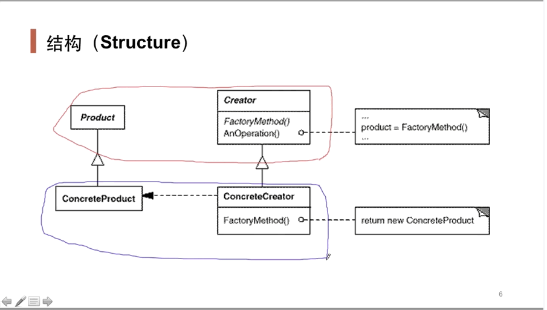
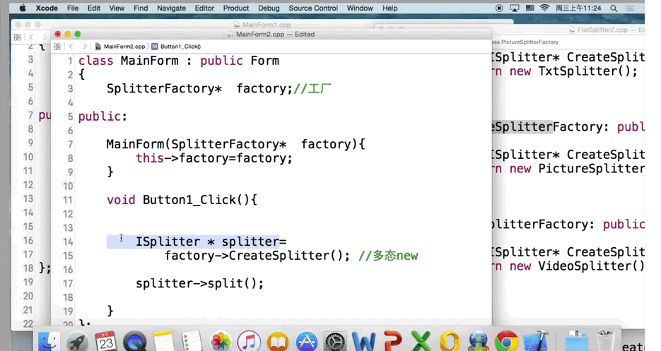
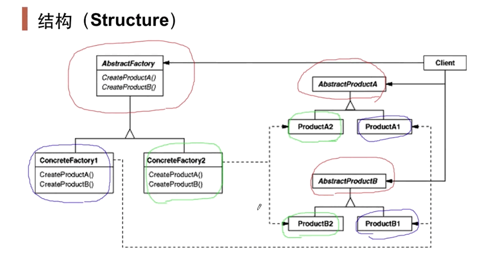

# 前言

> - 设计模式用于解决稳定中存在变化的需求场景。
>
>   两个极端：如果都是稳定的，则不需要设计模式，直接写就可以；如果所有地方都有变化，则没有任何设计模式可以解决问题
>
> - 设计模式不是消灭变化，而是将变化关在某一个地方，不让该变化任意出现在程序的任意位置

# 工厂方法

## motivation

>  通过“对象创建”模式绕开new，来避免对象创建（new）过程中所导致的紧耦合（以来具体的类），从而支持对象创建的稳定

> 定义一个用于创建对象的接口（工厂基类），让子类（具体工厂）决定实例化哪一个类。Factory Method使得一个类的实例化延迟到子类

 

- 红色框内的是稳定的（都是抽象的）
- 蓝色框内的是变化的（都是具体的）

例子：（将具体工厂通过构造方法传入）

 

- 以后如果要新增一个类，只需增加该类和该类对应的具体工厂，然后将具体工厂传入MainForm即可，MainForm本身并不需要改变

# 抽象工厂（家族工厂）

## motivation

> 在软件系统中，经常面临着“一系列相互依赖的对象”的创建工作（eg：数据库访问过程）；同时，由于需求的变化，往往存在更多系列对象的创建工作。

> 提供一个接口（家族工厂基类，也称抽象工厂），让接口负责创建一系列“相关或者相互依赖的对象”，无需指定它们具体的类。
>
> 与工厂方法的区别：抽象工厂用来解决  一系列相互依赖的对象 问题
>
> 工厂方法是抽象工厂的一个特列
>
> 有的地方直接称工厂模式，指的是既有可能是工厂方法，又有可能是抽象工厂

 

# 原型模式

