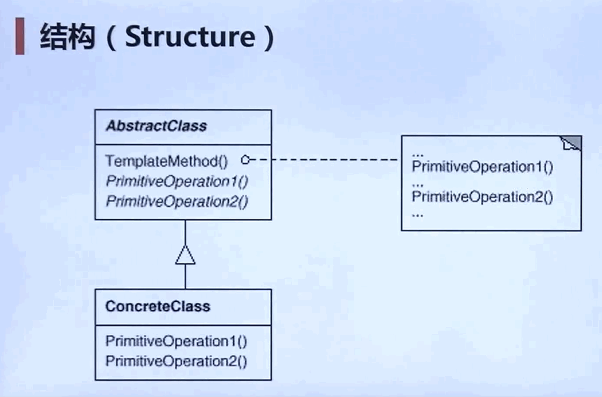
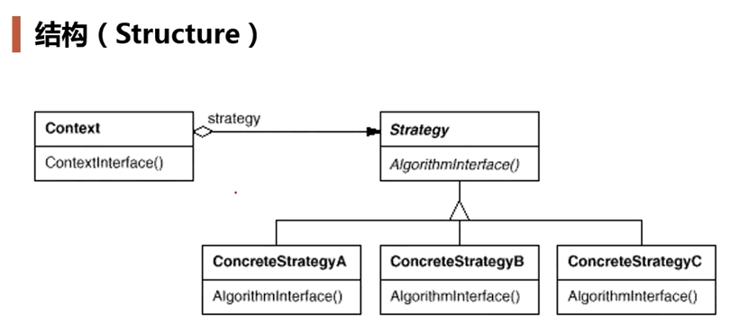

# 前言

> 组件协作模式：现代软件专业分工之后的第一个结果是“框架与应用程序的划分”，“组件协作”模式通过晚期绑定，来实现框架与应用程序间的松耦合，是二者之间协作时常用的模式。

典型模式：

- 模板方法
- 策略模式
- 观察者模式


# 模板方法

> ​		在软件构建过程中，对于某一项任务，它常常有==稳定==的整体操作结构，但各个子步骤却有很多==改变==的需求，或者由于固有的原因（比如框架与应用之间的关系）而无法和任务的整体结构同时实现。
>
> ​		如何在确定稳定操作结构的前提下，来灵活地应对各个子步骤的变化和晚期实现需求？


## 定义

> ​		定义一个操作中算法的骨架（稳定），而将一些步骤（变化）延迟到子类。模板方法使得子类可以不改变（复用）一个算法的结构的同时可以重定义（override）该算法的某些特定步骤
>
> - 模板方法前提：必须有一个稳定的算法骨架可以被重用（例如下面例子中某算法1 2 3 4 这几个步骤的顺序）
> - 变化的步骤（方法）可以实现，也可以不实现；一般设置为Protected
> - 该设计模式在面向对象编程中非常常用（我们一般是写的子类）

- 某个算法有step_1()，step_2()， step_3()， step_4()这四个有先后顺序的（稳定）步骤

  其中，step_2()， step_3()这两个步骤不是固定不变的；那么此时就可以将这4个步骤放到同一个类的某个方法run()中依次调用，2，3这两个方法设置为抽象方法；让子类自己去重写这两个步骤。最后直接调用子类对象的run()方法即可。  

- 父类中的run()就是模板方法


 


# 策略模式

> ​		在软件构建过程中，某些对象使用的算法可能多种多样，经常改变，如果将这些算法都编码到对象中，将会使得对象变得异常复杂，而且有时候支持不使用的算法也是一个性能负担
>
> ​		如何在运行时根据需要透明地更改对象的算法？将算法与对象本身解耦，从而避免上述问题？


## 定义

> ​		定义一系列算法，把它们一个个封装起来，并且使它们可互相替换（变化）。该模式使得算法可独立使用它的客户程序（稳定）而变化（扩展，子类化）


 


- 方法中用到`if`或者`switch`语句，来进行不同算法的调用

  ```java
  if(条件1){
      calculate() // 方法1
  }else if(条件2){
      calculate()  // 方法2
  }...
  ```

  可以将这些方法每个都抽取为一个类，在形成一个抽象基类；在调用时传入该方法对应的对象，使用动态绑定技术；这样如果以后新增一个方法，那么就增加一个子类即可，不用在源码中的if分支上进行增加，使得源码得以复用。并且在源码上新增代码，往往会带来之前存在的代码的BUG

- 遇到if或者switch分支语句，除非分支都是固定不变的，否则都可能利用策略模式；消除条件判断语句，就是在解耦和

- Strategy及其子类为组件提供了一系列可重用的算法，从而可以使得类型在运行时方便地根据需要在各个算法之间进行切换


# 观察者模式

> ​		在软件构建过程中，我们需要为某些对象建立一种“通知依赖关系” （一个对象即`目标对象`得状态发生改变，所有的依赖对象即`观察者对象`都将得到通知）；如果这样的依赖关系过于紧密，将使得软件不能很好地抵御变化。
>
> ​		使用面向对象技术，可以将这种依赖关系弱化，并形成一种稳定的依赖关系，从而实现软件系统结构的松耦合。


