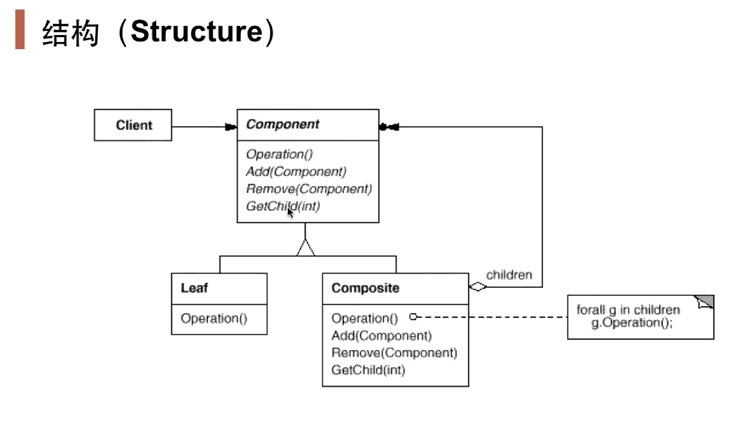

# 前言

> “数据结构”模式：常常有一些组件在内部具有特定的数据接哦古，如果让客户程序依赖这些特定的数据结构，将极大破坏组件的复用。这时候，将这些特定数据结构封装在内部，在外部提供统一的接口，来实现与特定数据结构无关的访问，是一种行之有效的解决方案。

典型模式：

- 组合模式
- 迭代器
- 责任链

# 组合模式

## 动机

> ​		软件在某些情况下，客户代码过多地依赖于对象容器复杂的内部实现结构，对象容器内部实现结构（而非抽象接口）的变化而引起客户代码的频繁变化，带来了代码的维护性、扩展性等弊端。
>
> ​		如何将“客户代码与复杂的对象容器结构”解耦？让对象容器自己来实现自身的复杂结构，从而使得客户代码就像处理简单对象一样来处理复杂的对象容器？

## 模式定义

> ​		将对象组合成树形结构以表示“部分-整体”的层次结构。Composite使得用户对单个对象和组合对象的使用具有一致性（稳定）[==客户代码对待单个对象或者组合的对象都是一样的对待方式==]。

 

==Composite重写的Operation()方法实现中，需要先处理当前节点，再处理叶子节点==

==Composite有一个属性：ArrayList<Component>elements = new ArrayList<>()==

用户只用把对象传入Component所暴露的接口即可，不用管该对象是单个对象（Leaf），还是组合的对象（Composite）。==两种对象的分别处理已经在接口内部实现，用户只需把要处理的对象出入接口就好==

