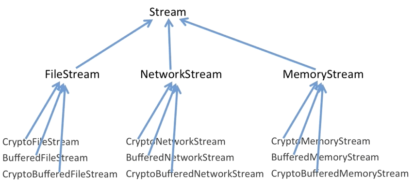

# 前言

> ​		“单一职责”模式：在软件组件的设计中，如果责任划分得不清晰，使用继承得到的结果往往是随着需求的变化，子类急剧膨胀，同时充斥着重复代码，这时候的关键是划清责任。

典型模式：

- 装饰器（Decorator）
- 桥（Bridge）

# 装饰器

## 动机

> ​		在某些情况下我们可能会“多度地使用继承来扩展对象的功能”，由于继承为类型引入静态特质，使得这种扩展方式缺乏灵活性；并且随着子类的增多（扩展功能的增多），各种子类的组合（扩展功能的组合）会导致更多子类的膨胀。
>
> ​		如何使“对象功能的扩展”能够根据需要来动态地实现？同时避免“扩展功能的增多”带来的子类膨胀问题？从而使得“功能扩展变化”所导致的影响降为最低？

## 模式定义

> ​		动态（组合）地给一个对象增加一些额外的职责。就增加功能而言，Decorator模式比生成子类（继承）更为灵活（消除重复代码 & 减少子类个数）

 

- Decorator类在接口上表现为`is-a`Component的继承关系，即Decorator类继承了Component类所具有的接口。但在实现上又表现为`has-a`Component的组合关系，即Decorator类又使用了另一个Component类
- Decorator模式的目的并非解决“多子类衍生的多继承问题”，其应用的要点在于解决“主体类在多个方向上扩展功能” - 是为“装饰”的含义

一个例子：

现在要对文件流、网络流等进行加密，缓冲，使用继承关系扩展功能如下：

 

这样会带来子类个数爆炸的问题，且无论是对文件流还是网络流进行加密，加密方式都是一样的。这样做，会导致代码的冗余。

改用如下的方式：

 

其中：

- DecoratorStream是将CryptoStream和BufferedStream中公共的成员提取出来
- CryptoStream和BufferedStream的构造方法参数均为动态传入一个流对象，然后成员中某方法进行具体操作并返回一个流对象

