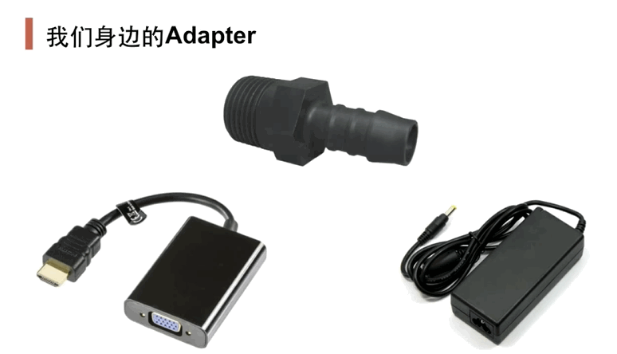
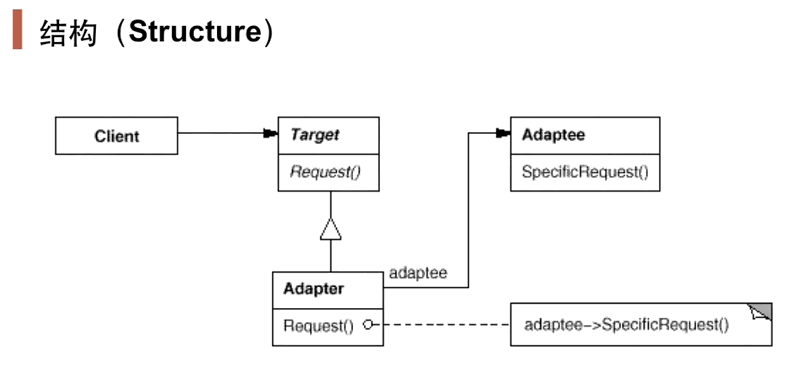

# 前言
## “接口隔离”模式

> ​		在组件构建过程中，某些接口之间直接的依赖常常会带来很多问题、甚至根本无法实现。采用添加一层间接（稳定）接口，来隔离本来相互紧密关联的接口是一种常见的解决方案
>
> 典型模式：
>
> - Facade
> - Proxy
> - Adapter
> - Mediator

# 适配器

## 模式定义

> 将一个类的接口转换成客户希望的另一个接口。Adapter模式使得原本由于接口不兼容而不能一起工作的那些类可以一起工作

 

 

- `Target.Request()`表示希望的接口（新接口），`Adaptee.SpecificRequest()`表示以前遗留的接口（老接口）
- Adapter继承Target，表明其遵从Target定义的接口规范；
- Adapter组合Adaptee表明其支持Adaptee的实现方式

## 要点总结

- Adapter模式主要应用于“希望复用一些现存的类，但是（现存的类）接口又与复用环境要求不一致的情况”，在遗留代码复用、类库迁移等方面非常有用
- GoF 23定义了两种Adapter模式的实现结构：对象适配器和类适配器。但是类适配器采用“多继承的”实现方式，一般不推荐使用。对象适配器采用“对象组合”的方式，更符合松耦合精神
- Adapter模式可以实现得非常灵活，不必拘泥于GoF 23中定义的两种结构。例如，完全可以将Adapter模式中的“现存对象”作为新的接口方法参数，来达到适配的目的

