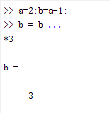

多任务可以在同一行，长任务可以用省略号在下一行进行延伸

 

## 输出格式化命令

> - `format short` ：默认，四舍五入到小数点后4位
> - `format long` ：四舍五入到小数点后15位
> - `format bank` ：四舍五入到小数点后2位
> - `format rat`：有理数近似

## 向量的创建

> - 行向量
>   - a=[1 2 3 4]
>   - a=[1,2,3,4]
> - 列向量
>   - b=[1;2;3;4]

## 矩阵的创建

>m = [1 2 3; 4 5 6]

# 数据类型

> matlab中所有的变量都可看成矩阵，例如a=1;那么a就可以看成1×1的矩阵
>
> matlab存储所有数组变量为double类型

MATLAB提供`15`种基本数据类型，分别是8种整型数据、单精度浮点型、双精度浮点型、逻辑型、字符串型、单元数组、结构体类型和函数句柄。

| 数据类型   | 描述                                                         |
| ---------- | ------------------------------------------------------------ |
| `int8`     | `8`位有符号整数                                              |
| `uint8`    | `8`位无符号整数                                              |
| `int16`    | `16`位有符号整数                                             |
| `uint16`   | `16`位无符号整数                                             |
| `int32`    | `32`位有符号整数                                             |
| `uint32`   | `32`位无符号整数                                             |
| `int64`    | `64`位有符号整数                                             |
| `uint64`   | `64`位无符号整数                                             |
| `single`   | 单精度数值数据                                               |
| `double`   | 双精度数值数据                                               |
| `logical`  | 逻辑值为`1`或`0`，分别代表`true`和`false`                    |
| `char`     | 字符数据(字符串作为字符向量存储)                             |
| 单元格阵列 | 索引单元阵列，每个都能够存储不同维数和数据类型的数组         |
| 结构体     | C型结构，每个结构具有能够存储不同维数和数据类型的数组的命名字段 |
| 函数处理   | 指向一个函数的指针                                           |
| 用户类     | 用户定义的类构造的对象                                       |
| Java类     | 从Java类构造的对象                                           |