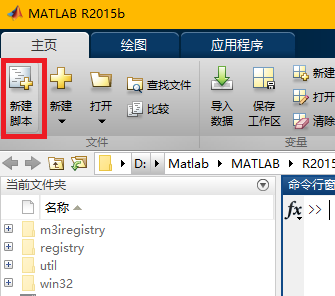

> MATLAB允许写两个程序文件：
>
> - 脚本 - 脚本文件 .m 扩展程序文件。在这些文件中写的一系列命令，想一起执行。脚本不接受输入和不返回任何输出。他们对工作区中的数据进行操作。
> - 函数 - 函数文件 .m 扩展程序文件。函数可以接受输入和返回输出。内部变量是本地的函数。
>
> .m 文件不一定要使用 MATLAB 编辑器创建，其他任何的文本编辑器也是可以的

# 脚本文件

## 创建

 

或者使用快捷键：`Ctrl+N`

> - 在脚本文件中创建的变量将会添加到工作区中

## 运行

直接在命令行输入文件名即可运行该脚本文件

