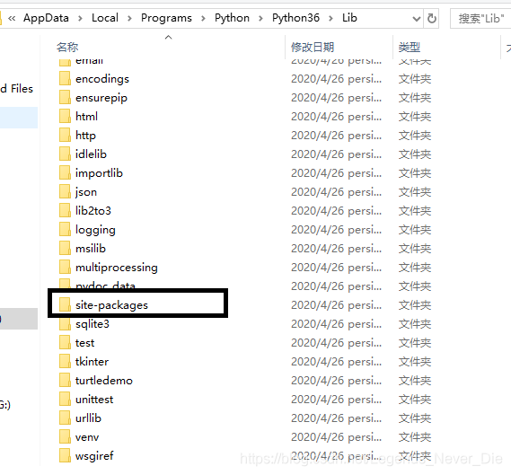
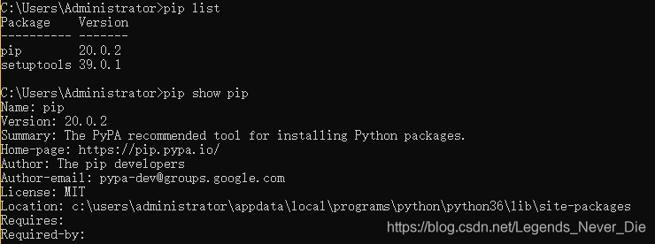
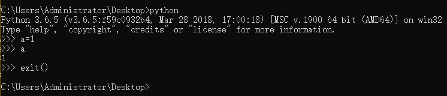
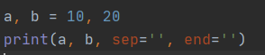
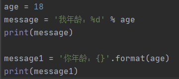

# 安装

**1、python是解释型，面向对象的弱类型语言**

**2、使用python语言**

- 需要去官网下载安装python解释器（python3.6.5）
  解释器安装完毕后，里面自带pip包管理命令以便安装依赖的包。以下是使用pip下载的包安装的位置：
  **C:\Users\Administrator\AppData\Local\Programs\Python\Python36\Lib**
  ​
- 安装Anaconda（推荐）

**3、几个常用的pip命令：**

> **查看已安装的包名及版本号：**pip list
> **查看已安装的某包具体信息：**pip show 包名
> **安装某包：**pip install xxx 
> **指定版本号安装：**pip install xxx\==版本号
> **卸载某包：**pip uninstall xxx
> **将项目安装的额外的包名及版本号输出到文件（Windows）：**pip freeze > requirements.txt
> **根据文件中的内容安装包（Linux）：**pip install -r requirements.txt
> ​

> **使用python或ipython命令可进入交互式编程界面，使用exit()退出**
> ​

> **python + .py文件，可以对python源文件进行解释执行**

---

# 常用

##  变量
python变量的命名规则与C相同；变量名可以使用驼峰式，但python更支持下划线连接两个单词
**给变量分别赋值**：a, b = 1, 2

## 常量
python中常量没有C那样的const，没有Java那样的final，常量的命名字母要求全部大写即可

## 字符串
python中字符串与JS相同，且增加了**三引号''' xxx '''**。
三引号（''' ''' 或 """ """）与单引号' '和双引号'' ''不同的是：1、使得字符串保持原始格式。2、可作为多行注释使用（**单行注释使用#**）
**级联字符串：**“12”“123” 等价于 "12123"
**自然字符串（通过在字符串前加r，字符串中的转义字符会原样输出）：**r"123 \n" 

##  print使用

**1、可使用加号+进行字符串拼接，但+两侧必须均为字符串**
**2、格式化输出，占位符与C相同。**
a, b = 10, 20
print("a的值为%d,b的值为%d" % (a, b))
**3、print默认输出后换行，且如果输出多个，之间默认有空格
可如下设置去掉空格和换行符**
​

**format使用**
​

##  input使用
a = input()
input()返回一个字符串，参数可有可无，一般放提示信息
如果想将a转换为数字类型，则需要使用**int()**函数

**查看关键字有哪些：**
import keyword 
print(keyword.kwlist)