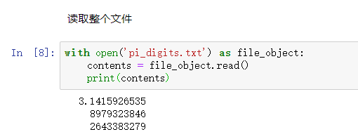
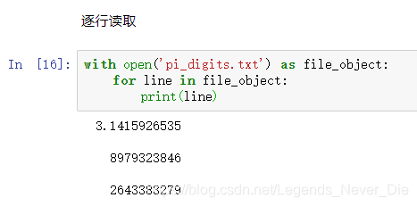
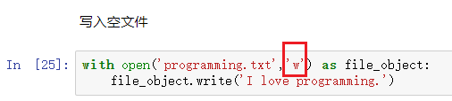
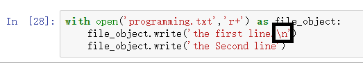
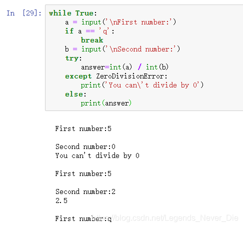

# 文件

## 从文件中读取数据

### **读取整个文件**

> **注：**
>
> 1、open()中的参数此处为该文件的相对路径，由于该文件和该python文件位于同一目录下，所以相对路径就是该文件名
>
> 2、file_object为文件对象
>
> 3、文件有open()必须有close()，这里用with代替close()，使得Python自己在适当时候关闭该文件
>
> 4、read()返回一个字符串，内容为该文件内容
>
> 5、Python将文件中所有文本都解读为字符串

### **逐行读取**

> **注：**这里每行的输出多一个空白行，是由于文件中每行的末尾有一个看不见的换行符，而print()也有一个换行
>
> 要想结果没有这个换行符，可以print(line,end='')消除print()的换行，或者print(line.rstrip())消除文件的换行

### 关于文件对象的readlines()方法

> file_object.readlines()方法从文件读取每一行，并将其存储在一个列表中，最后将该列表返回

## 写入文件

### 写入空文件

> 1、使用open()方法一般提供两个信息，文件路径+打开方式
> 打开方式：r：只读模式打开文件，w：写入模式打开，a：文本追加模式打开，r+：只读+写入模式打开
> 如果省略打开方式，则默认以只读模式打开文件
> 以写入模式打开文件，若文件不存在则创建该文件
>
> 2、Python只能将字符串写入文本文件，要将数值存储到文本文件中，先使用str()进行转化

### 写入多行

### 

> **只需要在字符串末尾添加\n即可**

### 附加到文件

> **将文件打开模式写为：'a'**

# 异常

> Python中的异常和Java中的异常相似，但又不完全相同

**看一个例子**

> 1、可使用两种形式：try - except，try - except - else
>
> 2、except后直接跟异常对象名字
>
> 3、如果发生异常，则只执行except代码块内容，不执行else代码块内容（如果else存在）
>
> 4、如果未发生异常，则只执行else代码块中的内容
>
> 5、如果在捕捉到异常时不发出任何提示，则可以在except代码块中直接写pass