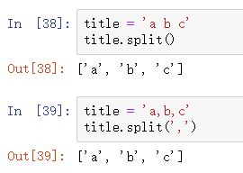
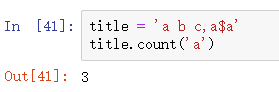

## 修改大小写：

**title()：字符串中每个单词首字母大写
upper()：所有字母均大写
lower()：所有字符小写**

## 字符串拼接：

**支持“+”进行字符串拼接**

## 剔除空白符：

**strip()：剔除开头和结尾空白符
lstrip()：剔除开头空白符
rstrip()：剔除结尾空白符**

## **文本分割：**

**split()：将字符串按照某个字符分割为多个部分，并将这些部分存储到一个list中返回**

## 计数：

**count()：判断一个字符串中出现了多少个该字符(串)**

