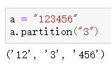
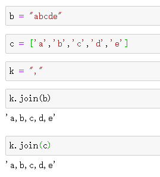
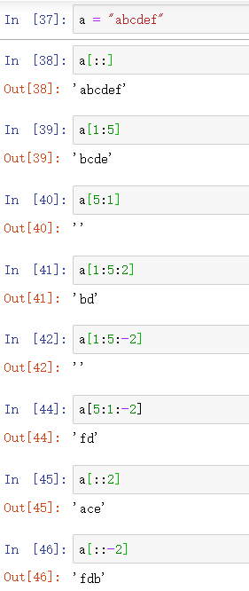

## 查找：

**find(str, start=0, end=len(mystr))：查找字符串[start,end)内是否包含字符串str，如果是返回开始的索引值，否则返回-1**

**startswith(obj)：检查字符串是否是以 obj 开头, 是则返回 True，否则返回 False**

**endswith(obj)：检查字符串是否以obj结束，如果是返回True,否则返回 False. **

## 修改大小写：

**capitalize()：字符串首字母大写**

**title()：字符串中每个单词首字母大写
upper()：所有字母均大写
lower()：所有字符小写**

## 字符串拼接：

**支持“+”进行字符串拼接**

## 剔除空白符：

**strip()：剔除开头和结尾空白符
lstrip()：剔除开头空白符
rstrip()：剔除结尾空白符**

## **文本分割：**

**split()：将字符串按照某个字符分割为多个部分，并将这些部分存储到一个list中返回**

**partition(str)：把mystr以str分割成三部分,str前，str和str后，并返回一个三者组成的元组**

 

## 插入

**join(sequence)：在sequence中每个元素后插入该字符串，并将结果做成一个字符串返回**

 

## 计数：

**count()：判断一个字符串中出现了多少个该字符(串)**

## 替换

**replace(str1, str2,  [mystr.count(str1)])：把字符串中的 str1 替换成 str2,如果 count 指定，则替换不超过 count 次**

## 切片：

> str[start​ : end : ​step]
>
> - [start , end)，从0开始计数，能被step整除的元素组成的集合

 

> 总：
>
> - 如果只有start，end，则start,end方向必须为正(end>=start)，为逆则截取为空串
> - 如果只有step，则步长方向为正，为逆均可
> - 如果三者均存在，则step方向必须与start -> end方向一致，否则截取空串

