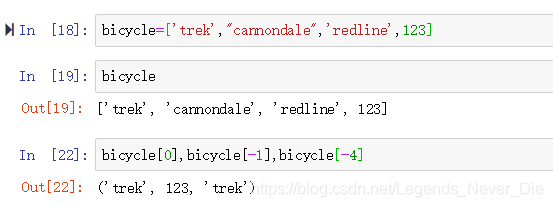
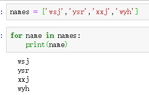
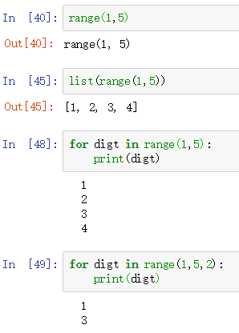
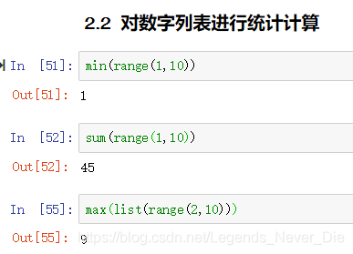
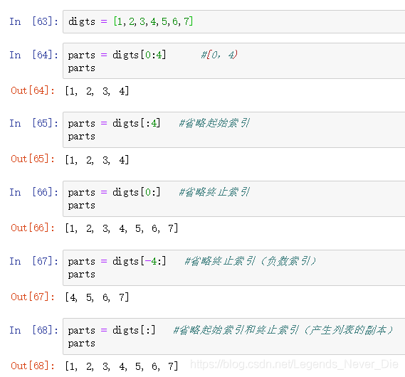

## 简介

列表由一系列按特定顺序排列的元素组成；列表中各个元素之间可以没有任何关系，可以将任何东西加入到列表之中
Python中使用方括号**[ ]**来表示列表，并用逗号来分隔其中的元素

## 元素访问

列表元素的访问按下标索引进行(从0开始)，但和C语言不用的是，该列表的索引可以取得负数：
-1为列表最后一个元素的索引，-2为列表倒数第二个元素的索引.....以此类推
​

## 列表操作

### 增加

append(新元素)：将新元素添加到列表末尾
extend(另一列表名)：将另一列表中的元素逐一添加到该列表中
insert(索引值，新元素)：将新元素添加到索引值所指向的位置

### 删除

del 列表名[索引值]：根据索引值删除列表中某个元素
remove(元素值)：根据元素值删除列表中的该元素（若该元素出现多次，则只删除第一个）
pop()：删除列表最后一个元素并返回
pop(索引值)：删除列表中索引值指向的元素并返回

### 修改

直接使用“=”修改列表某所引出的元素

### 查询



### 反转

reverse()：对列表元素进行永久反转

### 排序

**永久排序：**
sort()：对列表元素按字典序进行永久排序（升）
sort(reverse=True)：对列表元素按字典序进行永久排序（降）

**临时排序：**
sort(列表名)：对列表元素按字典序进行临时排序（升）并返回结果
sort(列表名，reverse=True)：对列表元素按字典序进行临时排序（降）并返回结果

### 获取长度：

len(列表名)：获得列表的长度值

### 数字列表

使用函数range()创建数字列表：
range(begin，end)：生成[begin,end)区间内步长为1的整数集
range(begin，end，step)：生成[begin,end)区间内步长为step的整数集
使用**list()**将该整数集转化为列表
​

**上图可见range()返回值并不是1个列表**



### 列表解析

列表解析简化了for循环生成列表的过程
​

### 切片

切片即列表的部分拷贝

 


## 列表推导公式

> 所谓的列表推导式，就是指的轻量级循环创建列表

### 基本的方式

 

### 使用if

 

### 两层for

 

### 练习

请写出一段 Python 代码实现分组一个 list 里面的元素,比如 [1,2,3,...100]变成 [[1,2,3],[4,5,6]....]

参考答案：

```python
a = [x for x in range(1,101)]
b = [a[x:x+3] for x in range(0,len(a),3)]
```