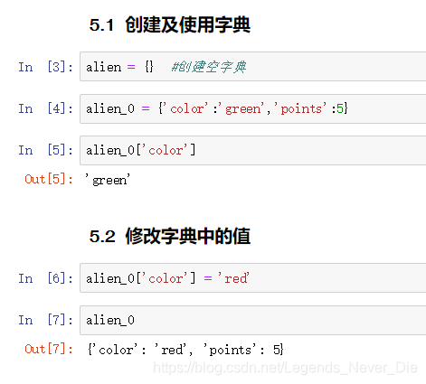
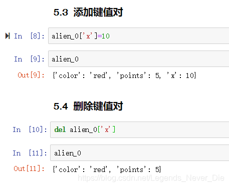
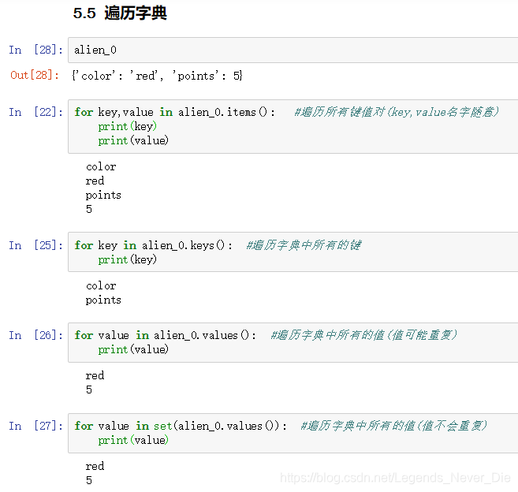
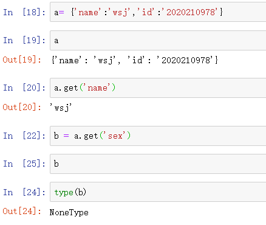

字典类似C++中的映射，在Python中，字典是一系列键-值对。每个键都与一个值相关联，可以使用键来访问与之相关联的值。值可以是Python中的任意对象，例如数字，字典，字符串，列表等

字典用花括号**{ }**以及其中的一系列键值对表示。键和值之间用冒号分隔，键值对之间用逗号分隔

## 常见操作补充

### 查看值

> 除了使用key查找数据，还可以使用get()来获取数据

 

- 使用get()方法获取不存在的键对应的值时，返回空
- 可以先使用has_key(键名)或者使用关键字in查看键值对是否存在，存在返回True

### 删除键值对

清空整个列表：clear()

### 获取字典中键值对个数

len(字典名)

