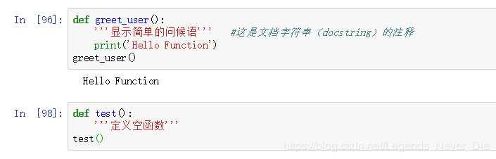
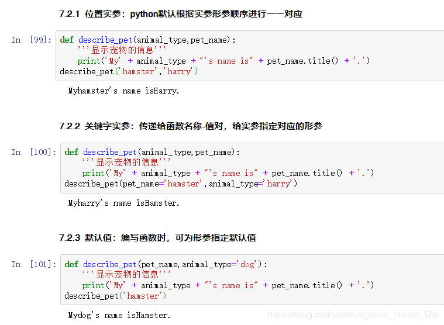
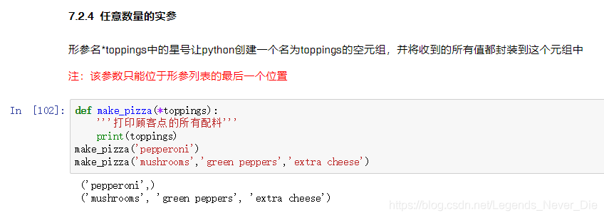
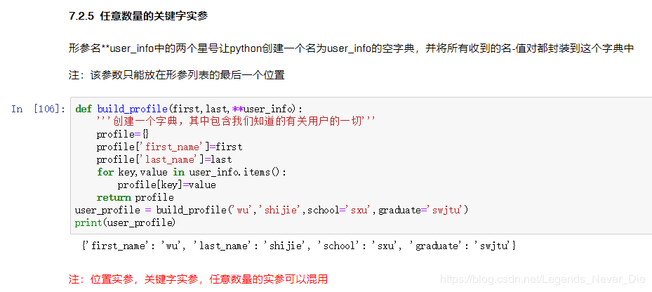
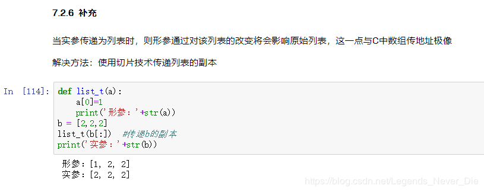
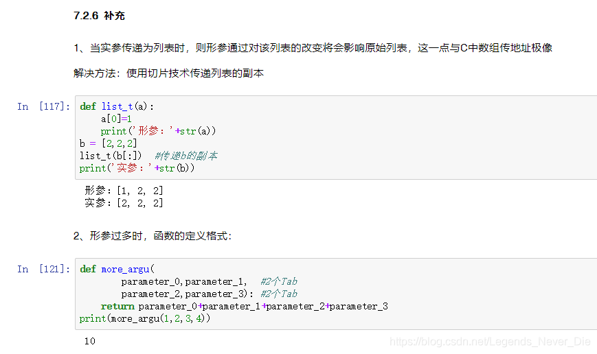
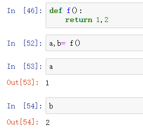
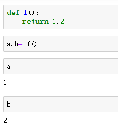
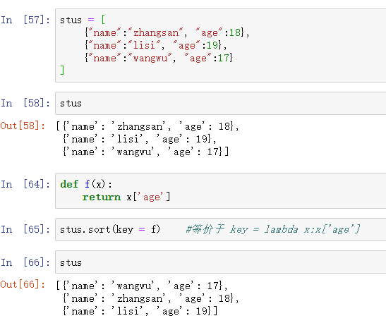
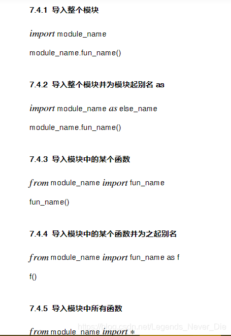

## 定义



## 参数










## 返回值



### 补充

> 返回值可以返回多个值，值存在一个元组里面

 


## 匿名函数

用lambda关键词能创建小型匿名函数。这种函数得名于省略了用def声明函数的标准步骤
匿名函数如果有返回值，只能返回一个值，不能返回多个

lambda函数的语法只包含一个语句，如下：

```python
    lambda [arg1 [,arg2,.....argn]]:expression
```

 

#### 自定义排序

 

## 使用存储在模块中的函数




## Python函数编写注意点

> 1、函数名使用小写字母+下划线
>
> 2、每个函数包含阐述其功能的文档字符串注释
>
> 3、给形参指定默认值时，等号两边不要有空格；函数调用中的关键字实参也应遵守这种约定