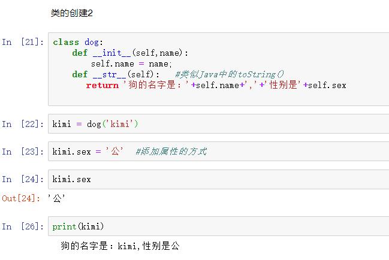
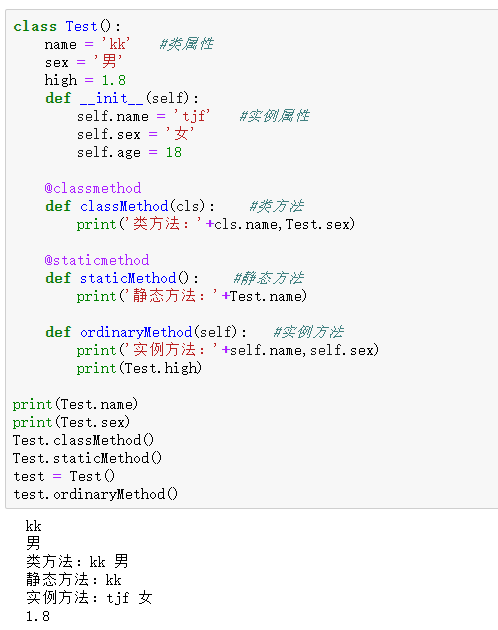
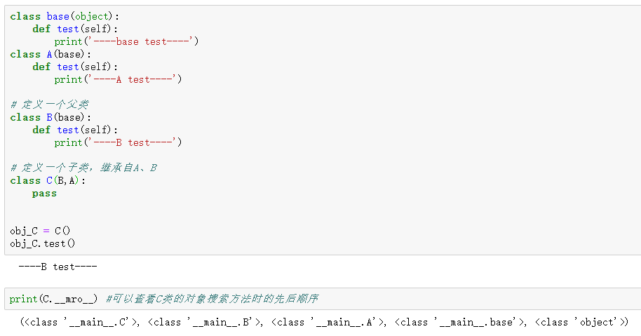

## 类的创建

> 注：
>
> `__init__()`方法不可少，为类的构造方法(同样也有析构方法`__del__()`，它在对象被销毁之前被执行)，类中属性的定义和初始化都在该方法中
>
> `__init__()`方法中self形参必须位于第一个位置，类似this，不可省
>
> 类中的成员均为公有

 

> 定义类时，类名可不加花括号
>
> `__str__()`方法类似Java的toString()方法
>
> 类中可通过字典中增加键值对的方式添加属性

### 属性的私有化

- Python中没有像C++中public和private这些关键字来区别公有属性和私有属性
- 它是以属性命名方式来区分，如果在属性名前面加了2个下划线'__'，则表明该属性是私有属性，1个下划线为受保护的属性，否则为公有属性（方法也是一样，方法名前面加了2个下划线的话表示该方法是私有的，1个下划线为受保护方法，否则为公有的）
- 私有属性或方法不能在类外直接访问

## 属性和方法

> 属性
>
> - 类属性：类本身所有
> - 实例属性：类创建的实例所有
>
> 方法
>
> - 类方法：类本身所有，只能访问类属性和类方法；必须有一个参数，参数指向类本身
> - 实例方法：实例所有，能访问任意属性和方法
> - 静态方法：类似类方法，只是可以没有参数

 

## 继承

### 单继承

> - 父类的`__init__()`方法会被子类继承，私有属性和方法不会被继承
> - 子类可以重写父类的`__init__()`方法，如果没有重写，则会默认调用从父类继承而来的该方法

### 多继承

Python支持多继承

当类C继承的类A,B均有同样方法时，会发生冲突，默认使用第一个父类的该方法

 

## 类的导入

 

## 类的编码风格

> 1、类名采用驼峰命名法，即类名的每个单词首字母大写，无下划线
>
> 2、每个类在定义后都应包含一个文档字符串，用来对类的功能进行简要描述
>
> 3、类中，可使用1个空格来分隔方法；模块中，可使用2个空格来分格类
>
> 4、需要同时导入标准库模块和自定义模块时，先导入标准库模块，空1行，导入自己定义的模块