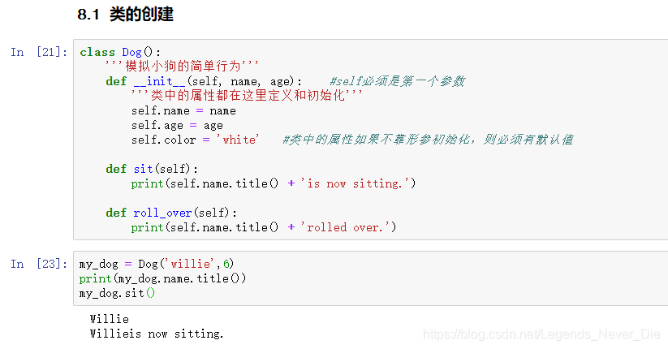
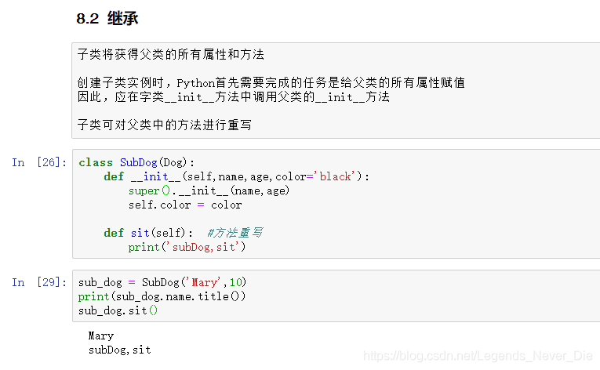
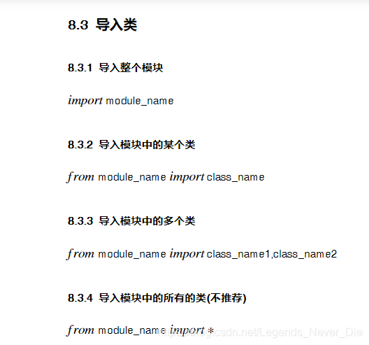

## 类的创建

> 注：
>
> __init__()方法不可少，为类的构造方法，类中属性的定义和初始化都在该方法中
>
> __init__()方法中self形参必须位于第一个位置，类似this，不可省
>
> 类中的成员均为公有

### 继承

### 类的导入

### 类的编码风格

> 1、类名采用驼峰命名法，即类名的每个单词首字母大写，无下划线
>
> 2、每个类在定义后都应包含一个文档字符串，用来对类的功能进行简要描述
>
> 3、类中，可使用1个空格来分隔方法；模块中，可使用2个空格来分格类
>
> 4、需要同时导入标准库模块和自定义模块时，先导入标准库模块，空1行，导入自己定义的模块