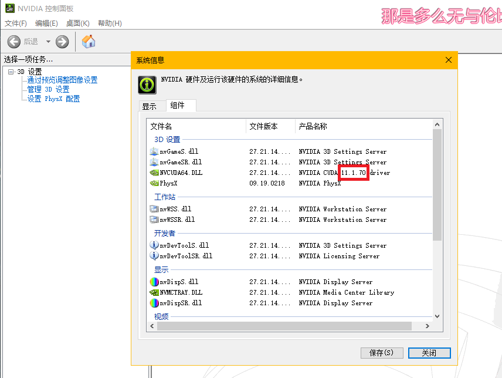

# CUDA

## 检查机器显卡驱动

- 桌面右击 -> NVIDIA 控制面板，如果没有的话就去官网安装驱动
-  

上面显示机器显卡驱动为11.1，所以CUDA只能是11.1及以下

## 下载

- CUDA安装可以去官网(很慢，网络不好的话下载的都是32B无效包)，但是最好点击下载好的exe文件安装

 

- 网盘中已有上述文件

## 安装

- 直接安装即可，安装其中的所有组件

### 遇到问题

 

- 上述方法操作过程中会导致屏幕分辨率暂时改变，安装CUDA时安装完显卡驱动就会恢复
- 最后显卡驱动和CUDA版本一致(可能不是最原始的版本，不过没关系)

# cuDNN

## 下载

- 去官网根据CUDA版本下载（不推荐，很慢，网速不行会下载32B无效包），第一次需要注册 -> 填写问卷
  - 2471778806@qq.com
  - QWERqwer1234

- 不用登陆，右键复制要下载的资源链接，在迅雷中下载（推荐）

## 使用

将压缩包解压后，将其中3个目录**对应的文件**复制到

`C:\Program Files\NVIDIA GPU Computing Toolkit\CUDA`的对应目录中