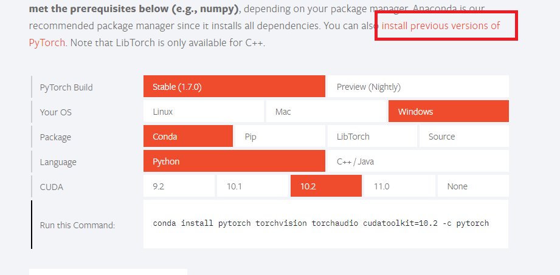
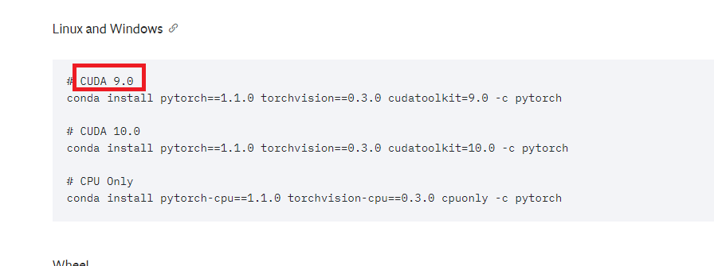
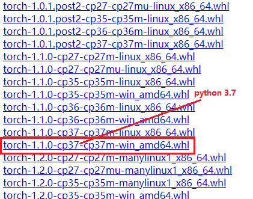
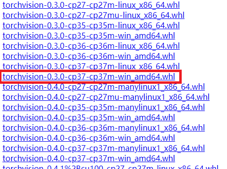
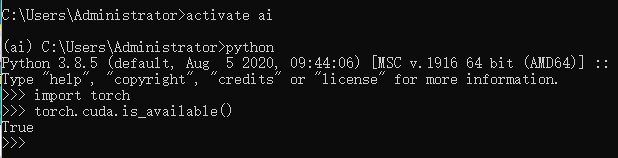

## 去官网看自己机器CUDA对应的安装方式

 

这里只有9.2 10.1 10.2 11.0这几个CUDA对应的安装方式，如果需要CUDA9.0及之前的，则点击红框的链接

 

比如CUDA 9.0，可以看到需要torch\=\=1.1.0 和 torchvision\=\=0.3.0

## 用官网命令安装

> 使用官网提供的命令安装太慢，使用清华源也是很慢

- 利用该命令主要下载pytorch-gpu所需的一些别的小的包
- torch包很大几百MB，或者torchvision包 是下载不成功的，不过没有关系

## 下载轮子

- 这里我们就要用离线的方式安装torch，`https://download.pytorch.org/whl/cu100/torch_stable.html`
- 例如要下载CUDA 9.0的torch和torchvision包，从官网已经知道，CUDA 9.0对应torch\=\=1.1.0，torchvision\=\=0.3.0

 

## 安装轮子

- 激活某个虚拟环境
- cd 到轮子安装目录 -> `pip install 名称`

- 中间如果报错，则安装或更新提示的包即可

## 测试

 