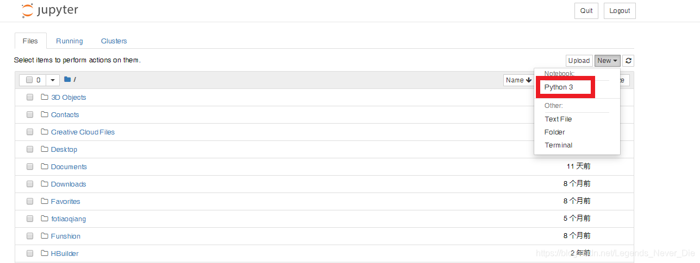

## jupyter notebook启动

在cmd某工作目录下输入**jupyter notebook**即可（创建的文件都会存在于该目录下）
​

> 注：如果安装了Anaconda，则先切换到目标环境，再进行命令启动；也可以从Anaconda客户端界面进行启动

## jupyter notebook使用

### 创建一个文件



### 命令模式

进入编辑模式：Enter
上下移动：上/下键
Y：代码模式
运行单元格：Ctrl+Enter
运行单元格并选中下一行单元格：Shift+Enter
Y：把单元格变称代码编辑器
M：把单元格变称markdown编辑器
DD：删除
X：剪切
C：复制
V：粘贴
Ctrl+S：保存

### 编辑模式

进入命令模式：Esc
补全代码：Tab
运行单元格：Ctrl+Enter
运行单元格并选中下一行单元格：Shift+Enter
Ctrl+S：保存


---

## 拓展功能

1、切换到目标环境

2、执行下述代码即可（安装**jupyter_contrib_nbextensions**库）

```shell
python -m pip install jupyter_contrib_nbextensions
jupyter contrib nbextension install --user --skip-running-check
```

3、勾选需要的功能选项


