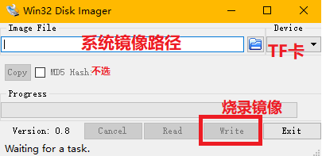
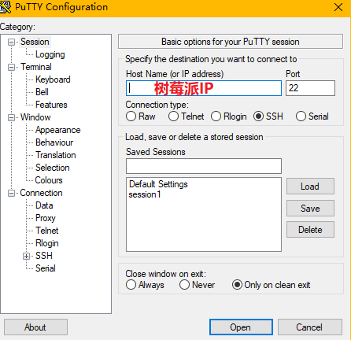
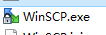
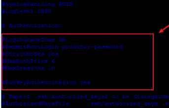
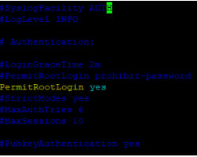

# 硬件

> - 树莓派开发板 4B
> - 开发板供电的Type-C 电源( `5V/3A` )
>   - 电压不足会导致很多问题
> - TF卡，又称micro SD卡
>   - SD卡与TF卡区别：TF卡约为SD卡的 1/4，且TF卡可以插在SD卡中，然后SD卡可以插在笔记本接口上作为读卡器使用
> - 读卡器（向TF卡中写入镜像时使用）
>   - 若有SD卡，可以不需要该项
> - HDMI线（无屏幕可不需要）
>   - 高清多媒体接口（High Definition Multimedia Interface，*HDMI*）是一种全数字化视频和声音发送接口，可以发送未压缩的音频及视频信号。*HDMI*可用于机顶盒、DVD播放机、个人计算机、电视、游戏主机、综合扩大机、数字音响与电视机等设备。
>   - 树莓派4B开发板上有两个micro HDMI接口

---

# 软件

## TF卡格式化

### SD Formatter

 

- 如果TF卡中存在Linux系统，则不能使用该软件进行格式化；含有Linux系统的存储器一般分为两个区：Boot(格式为FAT 32)，文件系统（Ext4）；该软件只能识别Boot分区，故不能使用该软件进行整个存储器的格式化

### DiskGenius（推荐）

 

- 无论该TF内是什么内容都可进行格式化
- 若卡内有Linux的两个分区，则先将两个分区，鼠标右键依次删除，然后在该整个磁盘上新建分区，保存设置即可；保存之后，该卡会被读卡器重新读入。

---

##  系统烧录（备份）

### Win32DiskImager

 

 

- 上述选择Write，则可将镜像烧录到已格式化的TF卡中
- 若选择Read，则可以将该TF中的镜像整个备份到路径为Image File这个文件中
  - 备份过程不进行压缩
  - 路径为Image File的文件是自己创建的空文件，扩展名为`.img`

---

## 远程

### 命令远程：putty

 

> - 树莓派默认用户：`pi`，密码：`raspberry`
> - 更改putty文字：
>   - 新建session，如上图新建了session1
>   - Window -> Appearance -> font选择字体
>   - 以后登陆，直接点击session1进入命令行

### 桌面远程：VNC-Viewer

 

- File -> New connection

> 注：若提示当前无法显示桌面，则是树莓派分辨率问题
>
> - 在putty中使用命令：`sudo raspi-cofig`进入设置界面进行设置

### 文件互传：WinSCP

 

> 注：由于权限不足，无法通过该软件将文件传输至树莓派或者在树莓派文件系统新建文件等：
>
> 解决思路：用root进行WinSCP的登陆即可
>
> - 使用putty登陆，设置root密码 `sudo passwd root`
>
> - 将登陆身份由普通用户pi切换至root用户：`su`
>
> - 打开root远程登陆的权限（修改配置文件）
>
>   - `nano /etc/ssh/sshd_config`
>
>     - 找到如下地方：
>
>        
>
>     - 在`#PermitRootLogin prohibit-password`下一行添加`PermitRootLogin yes`，即： 
>
>     - 保存退出，重启系统`reboot`
>
>     - 使用root登陆，密码为刚才自己设置的密码

