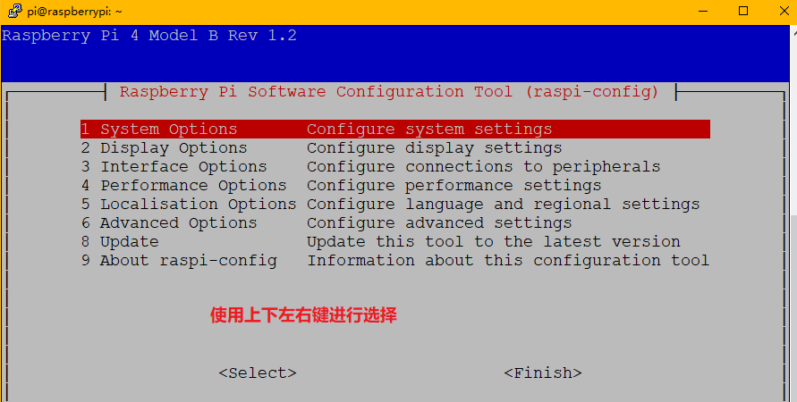
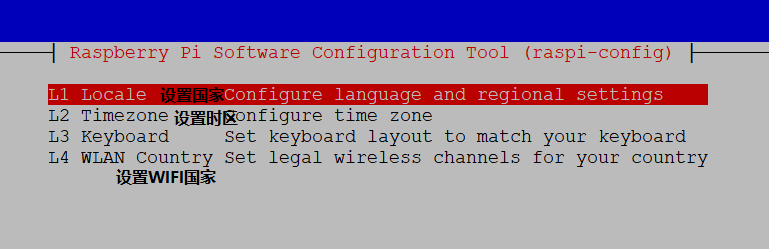
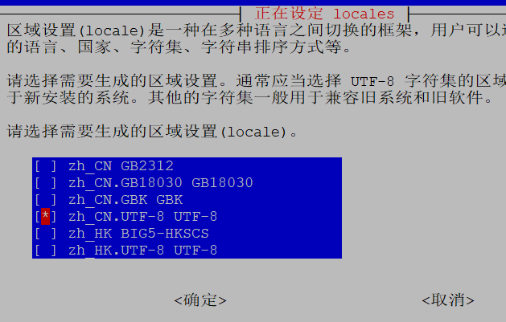
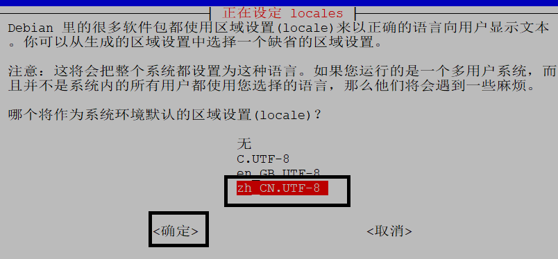
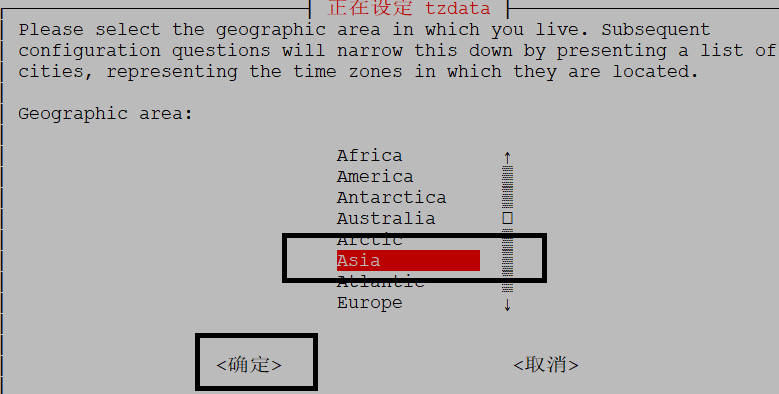
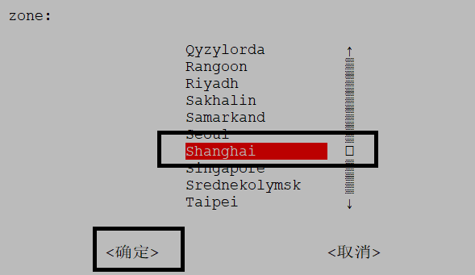
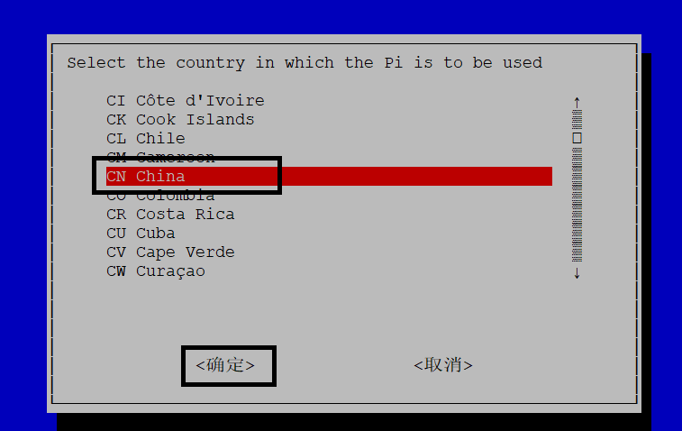
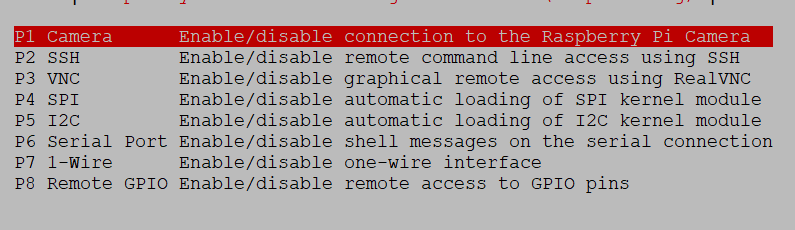
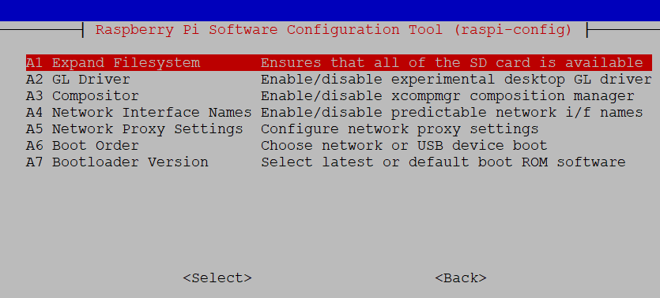

# 开机前配置

> 现在假定已向TF卡中烧录镜像

## 无屏幕

> 我们需要使用putty或者VNC-Viewer进行远程连接
>
> - 大前提：树莓派可以连接网络
>
> - 使用putty的前提：树莓派开启了ssh服务（默认无）
>
> - 使用VNC-Viewer前提：树莓派开启了VNC服务（默认无，一般先进入putty，由命令开启）
>
> `方式：`
>
> - 在烧录完系统镜像后，在Windows文件系统可以看到Boot分区，在该分区根目录下新建一个名称为`ssh`的空白文件，无后缀。这样就相当于开启了ssh服务
>
> - 用同样的方法新建一个空白文件`wpa_supplicant.conf`
>
>   用文本编辑器打开`wpa_supplicant.conf`,输入以下配置，可以用多个network{...}来配置多个网络(在配置的多个网络均可用是，priority属性值越大，优先级越高)：
>
>   ssid为网络名称，psk为密码
>
>   ```python
>   country=GB
>   ctrl_interface=DIR=/var/run/wpa_supplicant GROUP=netdev
>   update_config=1
>   network={
>   	ssid="qwerqwer"
>   	psk="1234567890"
>   	priority=5
>   }
>   network={
>   	ssid="qwerrewq"
>   	psk="1234567890"
>   	priority=4
>   }
>   ```
>
> - 这两样配置完成，即可将TF插入树莓派（注：金手指面向开发板），启动后使用putty进行连接


# 开机后配置

## 换源

### apt-get换源

> `apt-get`为Rapsbian的包管理器
>
> - 在命令行界面输入：`sudo nano /etc/apt/sources.list` 
>
>   - 意为：使用管理员权限通过nano编辑器打开该文件（不存在则创建）
>
> - 将第一行注释掉，在最后加入如下两行：
>
>   ```python
>   deb http://mirrors.tuna.tsinghua.edu.cn/raspbian/raspbian/ buster main contrib non-free rpi
>       
>   deb-src http://mirrors.tuna.tsinghua.edu.cn/raspbian/raspbian/ buster main contrib non-free rpi
>   ```
>
> - Ctrl + O 再回车进行写入保存，Ctrl + X 退出
>
> - 更新到清华大学镜像源最新软件列表：`sudo apt-get update `


### pip换源

> - 命令行依次输出以下三个命令：
>
> ```python
> sudo mkdir ~/.pip
> cd .pip
> sudo nano pip.conf
> ```
>
> - 在打开的文件中添加如下内容即可：
>
> ```python
> [global]
> timeout = 10
> index-url =  http://mirrors.aliyun.com/pypi/simple/
> extra-index-url= http://pypi.douban.com/simple/
> [install]
> trusted-host=
>     mirrors.aliyun.com
>     pypi.douban.com
> ```
>
> - 先按键盘上的`ctrl`+`o`，再按回车保存，再按`ctrl`+`x`退出nano编辑器回到命令行界面

---

## 树莓派内部设置

进入设置界面：`sudo raspi-config`

 

---

### 设置语言和地区

> 选择第四项 -> 回车进入
>
>  
>
> - ==设置国家==：
>   -  
>   - 选择到上述该项，空格确定，回车返回到上一级
>   -  
> - ==设置时区==：
>   -  
>   -  
> - ==设置WIFI国家==
>   -  


### 开启相关接口

> 选择`Interface Options`
>
>  
>
> - Camera：摄像头
>
>   SSH：ssh远程通信与登陆 （之前添加的空白ssh文件相当于开启了此功能）
>
>   VNC：VNC远程桌面登陆  (VNC-viewer需要)
>
>   Serial：串口控制
>
>   Remote GPIO：远程GPIO引脚控制


### 高级选项

> 选择 `Advanced Options`
>
>  
>
> - Expand Filesystem：将根目录扩展到这个SD卡，充分利用SD卡的存储空间


## 安装中文字体及输入法

打开树莓派命令行，输入以下命令

```shell
sudo apt-get install fonts-wqy-zenhei
```

> 这行命令里的`sudo`表示使用管理员root权限，`apt-get`表示使用apt-get包管理器来下载，`install`表示下载安装，`fonts-wqy-zenhei`表示软件名字。之后所有的`sudo apt-get install 软件名`都表示这样的意思。

接下来，安装中文输入法fcitx及Google拼音输入法（大约需要五分钟）

```shell
sudo apt-get install fcitx fcitx-googlepinyin fcitx-module-cloudpinyin fcitx-sunpinyin
```

在跳出的对话框中输入`y`和回车`↩`，确定下载安装，需要90MB存储空间。

安装成功之后，会在下一次重启时生效。

可以使用`ctrl`+`空格`切换为中文输入法。