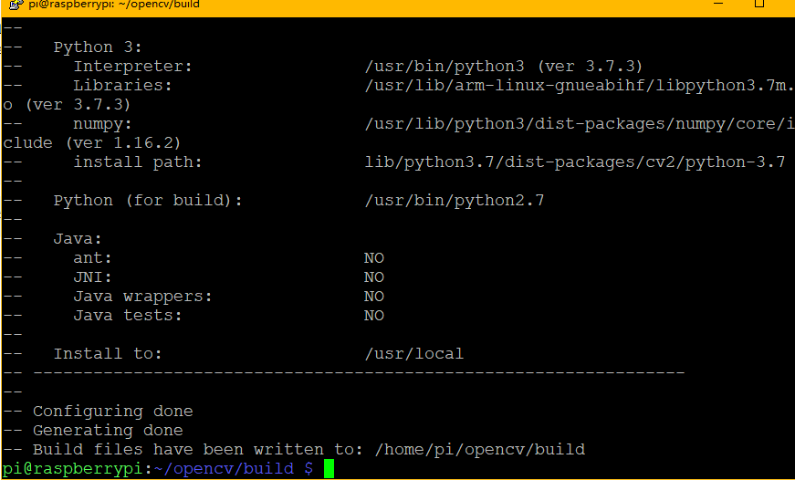
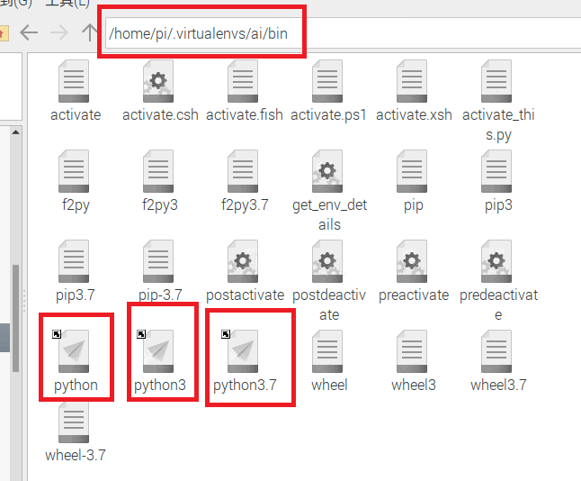

# 前言

> 本教程用于用树莓派 4B安装OpenCV 4.3.0 和 OpenCV_contrib 4.3.0
>
> - 为什么安装OpenCV_contrib 4.3.0
>   - OpenCV_contrib库中包括了人脸识别、matlab调用、RGB加工、深层神经网络等内容.
>   - 可以将其理解为OpenCV扩展的一个模块
>   - 其版本要和所要安装的OpecCV版本一致，这里都是4.3.0
>   
> - 安装总体流程：
>
>   `下载OpenCV源码 -> 将源码编译为可运行程序 -> 安装该程序`

---


# 详细步骤

- 安装cmake等安装OpenCV所必要的工具
  - `sudo apt-get install build-essential cmake pkg-config unzip`
- 安装几种常见格式的图像操作的包
  - `sudo apt-get install libjpeg-dev libtiff5-dev libjasper-dev libpng12-dev`
- 安装视频操作的包
  - `sudo apt-get install libavcodec-dev libavformat-dev libswscale-dev libv4l-dev`
- 安装gtk3.0
  - ` sudo apt-get install libgtk3.0-dev`
- 安装优化函数包
  - `  sudo apt-get install libatlas-base-dev gfortran`
- 其他
  - `sudo apt-get install libxvidcore-dev libx264-dev`
  - `sudo apt-get install libcanberra-gtk*`


> 执行到这里，安装OpenCV所要依赖的工具包等全部安装好了

- 下载OpenCV 4.3.0

  - `wget -O opencv.zip https://github.com/opencv/opencv/archive/4.3.0.zip`

- 下载OpenCV_contrib 4.3.0

  - `wget -O opencv_contrib.zip https://github.com/opencv/opencv_contrib/archive/4.3.0.zip`
  - 在下载该项时，另开一个终端，对已下载的OpenCV 4.3.0进行解压缩
    - `unzip opencv.zip`

- 对OpenCV_contrib 4.3.0进行解压缩

  - `unzip opencv_contrib.zip`

- 重命名

  - `mv opencv-4.3.0 opencv`
  - `mv opencv_contrib-4.3.0 opencv_contrib`

- 安装虚拟环境

  - `sudo pip install virtualenv virtualenvwrapper`

  - `执行如下命令[作用为：在profile文件最后添加内容]：`

    - `echo -e "\n# virtualenv and virtualenvwrapper" >> ~/.profile`
    - `echo -e "export WORKON_HOME=$HOME/.virtualenvs" >> ~/.profile`
    - `echo -e "export VIRTUALENVWRAPPER_PYTHON=/usr/bin/python3" >> ~/.profile`
    - `echo -e "export VIRTUALENVWRAPPER_VIRTUALENV=/usr/local/bin/virtualenv" >> ~/.profile`
    - `echo -e "export VIRTUALENVWRAPPER_ENV_BIN_DIR=bin" >> ~/.profile`
    - `echo -e "source /usr/local/bin/virtualenvwrapper.sh" >> ~/.profile`

  - 刷新Shell环境：`source ~/.profile`

  - 若出现问题：

     

    解决方法：`python3 -m pip install --user virtualenvwrapper --upgrade`

- 创建虚拟环境

  - `mkvirtualenv ai -p python3`

  - 补充：

    > - 创建虚拟环境后，会自动进入该环境下
    > - 退出该环境：`deactivate`
    > - 进入环境：`workon ai`
    > - 查看环境：`workon`
    > - 删除环境：`rmvirtualenv ai`

- 在所创建的虚拟环境下安装numpy

  - `pip install numpy`

  - 在安装numpy过程中，另开启一个终端：

    - `cd ~/opencv`

    - 新建一个名为build的文件夹用来存放cmake配置时产生的临时文件：`mkdir build`

    - `cd build`

    - 配置cmake参数：

      ```python
      cmake -D CMAKE_BUILD_TYPE=RELEASE \
            -D CMAKE_INSTALL_PREFIX=/usr/local \ 
            -D OPENCV_EXTRA_MODULES_PATH=~/opencv_contrib/modules \
            -D ENABLE_NEON=ON \
            -D ENABLE_VFPV3=ON \
            -D BUILD_TESTS=OFF \
            -D OPENCV_ENABLE_NONFREE=ON \
            -D INSTALL_PYTHON_EXAMPLES=ON \
            -D BUILD_EXAMPLES=ON ..
      ```

      > 补：若cmake配置过程中出现问题，则把build文件删除，再新创建一个build文件进行
    
  - 配置成功截图：

     

- 临时增加交换空间大小，提升编译速度（可以不做该项，如果做了，在安装结束后再恢复）
  
  - `sudo nano /etc/dphy-swapfile`
  - `CONF_SWAPSIZE=100` -> `CONF_SWAPSIZE=2048`
  - 重启该文件：
    - `sudo /etc/init.d/dphy-swapfile stop`
    - `sudo /etc/init.d/dphy-swapfile start`
  - 补：==恢复过程与上述步骤一样，只不过把2048重新改为100==
  
- 将编译中难以下载的文件（asset文件中）提前放入对应目录中：
  
   
  
- 编译源码（当前工作目录还是在build目录下）[time: 1-2h]：

  - `sudo make`

  - 也可以使用4个核心加速编译过程，若出错则使用上面的`sudo make -j4`

  - 编译成功截图：

     

- 安装opencv

  - `sudo make install`

- 更新链接库

  - `sudo ldconfig`

- 测试

   

  注：OpenCV经过上述操作，默认装在全局环境下，在该环境下直接写脚本使用opencv默认使用python3

  如何查看使用的是python版本：

  ```python
  import sys
  print(sys.version)
  ```

  

> 由于上说过程将OpenCV装在全局环境下，在虚拟环境中无法使用全局环境中的库；这时需要使用软链接将全局环境下的opencv链接到虚拟环境中；该过程不会占用磁盘空间，相当于创建一个超链接/快捷方式

- 进入虚拟环境下的site-packages目录中：

  `cd /home/pi/.virtualenvs/ai/lib/python3.7/site-packages`

- 进行链接：(格式：ln -s  源目录/文件  目标目录/文件)

  `ln -s /usr/local/lib/python3.7/dist-packages/cv2/python-3.7/cv2.cpython-37m-arm-linux-gnueabihf.so cv2.so `

  源文件：

   

  链接后的结果：

   

- 测试：

   


# 使用虚拟环境执行python脚本

> 找到虚拟环境下的python可执行文件
>
>  
>
> 可以发现上面有3个可执行文件，选择任意一个都可以。python版本都和创建虚拟环境时指定的版本一致


- 桌面上创建测试文件：test.py

   

-  

  可以看到numpy和python的版本均为虚拟环境中的版本且opencv也链接成功


补：系统在带的python可执行文件存放在/usr/bin中：

 

可以看到numpy版本为全局环境下的版本