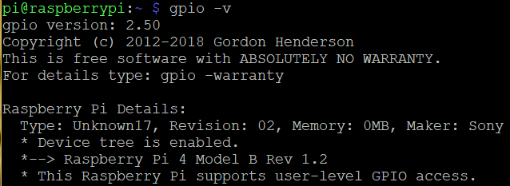
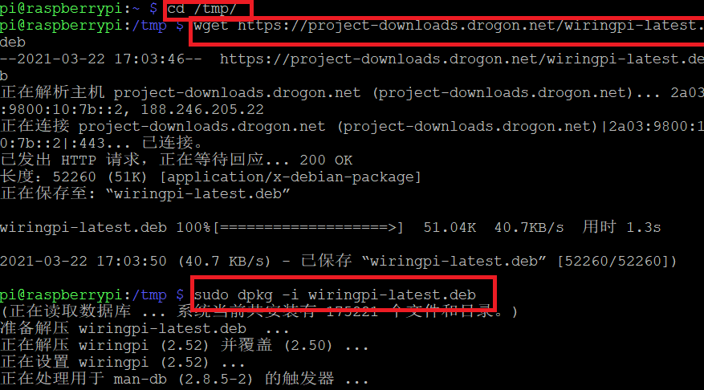
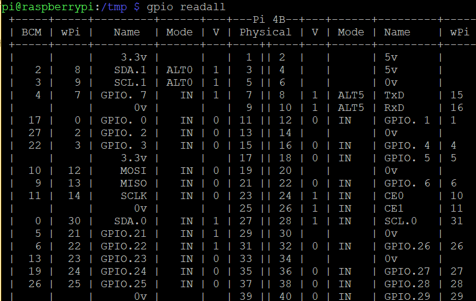

# 前言

> WiringPi是一个用C语言编写的、基于PIN的GPIO访问库，提供了GPIO、I2C、SPI、UART和PWM等库，对于树莓派的GPIO编程相当方便。
>
> 树莓派下载的RaspberryPi自带该软件，可通过`gpio -v`来查看版本
>
>   
>
> 当时要用`gpio readall`去查看GPIO会出现无法识别情况，需要进行更新，并且该自带的wiringPi库是针对C语言的，python代码中不能用
>
>  

# C -> 升级WiringPi

- `cd tmp`

- `wget https://project-downloads.drogon.net/wiringpi-latest.deb`

- `sudo dpkg -i wiring-latest.deb`

   

- 检查信息

  - `gpip -v`

    信息为2.52

  - `gpio readall`

     

# python安装WiringPi

进入相应虚拟环境执行如下指令即可

- `pip install wiringpi`