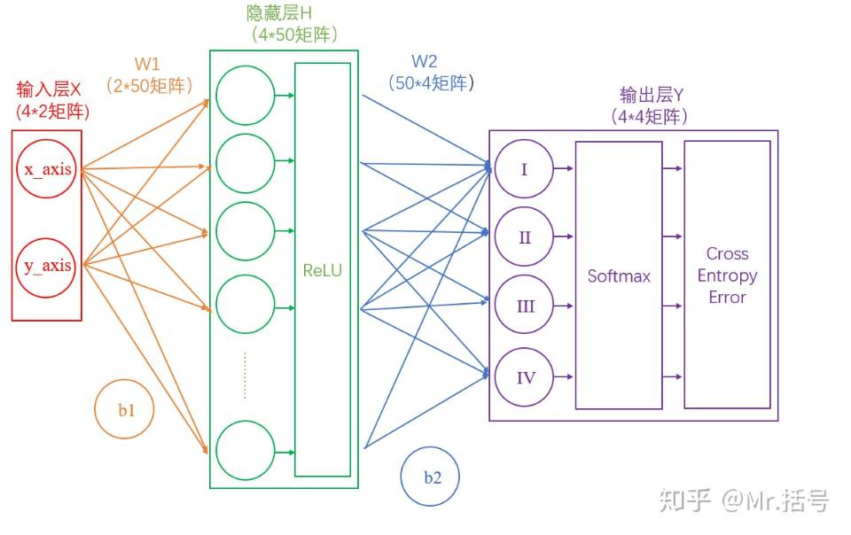
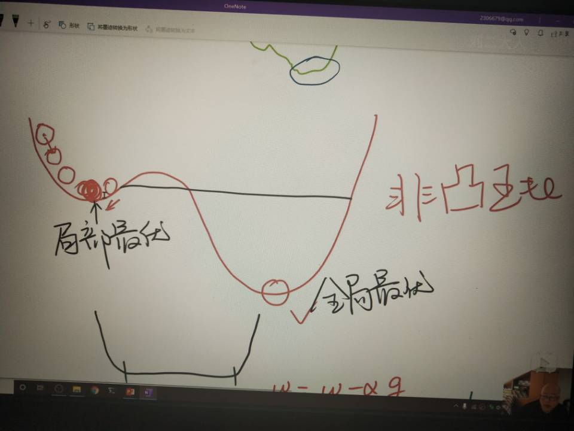
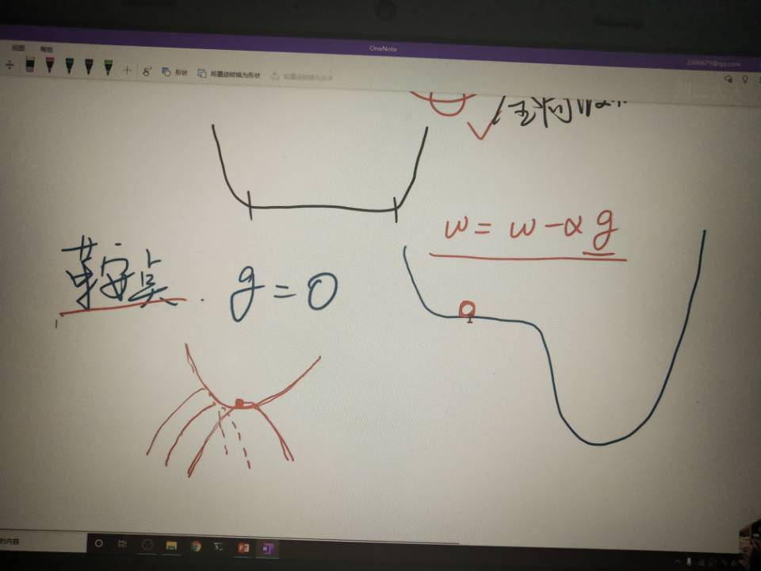
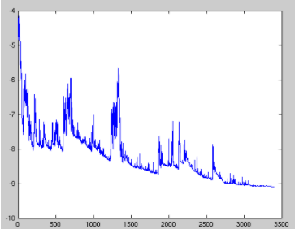

# 神经网络

## 前馈神经网络

前馈神经网络是最先发明也是最简单的人工神经网络 。它包含了安排在多个层中的多个神经元。相邻层的节点有连接或者边，所有的连接都配有权重；前馈神经网络又称之为全连接神经网络，感知机

单层感知机只有一个隐藏层
多层感知机（Multilayer Perceptron MLP）有多个隐藏层

一个前馈神经网络可以包含三种节点：

- 输入节点（Input Nodes）：输入节点从外部世界提供信息，总称为「输入层」。在输入节点中，不进行任何的计算——仅向隐藏节点传递信息。输入节点为1个样本的特征值，N个样本的M特征值就构成(N,M)的矩阵

- 隐藏节点（Hidden Nodes）：隐藏节点和外部世界没有直接联系（由此得名）。这些节点进行计算，并将信息从输入节点传递到输出节点。隐藏节点总称为「隐藏层」。尽管一个前馈神经网络只有一个输入层和一个输出层，但网络里可以没有也可以有多个隐藏层

- 输出节点（Output Nodes）：输出节点总称为「输出层」，负责计算，并从网络向外部世界传递信息

  

以上就是一个解决4分类问题的全连接神经网络

> 每层神经元的个数决定了该层的维度，以上图为例
>
> - 输入层为2个神经元，说明该层为2个维度，每个样本都是两个特征值
> - 隐藏层为50个神经元，说明该层为50维度
> - 以上两点决定了这两层之间权重w矩阵的形状为(2,50)
> - 每个样本的两个特征值都要分别到50个神经元参与线性计算，结果在进行ReLU激活函数处理

Kolmogorov理论指出：**双隐层感知器就足以解决任何复杂的分类问题**

# 神经网络一般代码步骤

- 准备数据
- 设计模型
- 准备损失函数和优化器
- 训练模型
  - 权重随机初始化
  - 正向传播构建计算图和求损失
  - 反向传播+优化算法(如：梯度下降)更新权重
- 正向传播和反向传播进行多次迭代

# 损失函数(Loss)

> 把损失函数看成权重w和偏置量bias的函数，损失函数建立在输入的样本数据集之上

# 优化器算法(Optimizer)

> **对于优化算法，优化的目标是网络模型中的参数θ（是一个集合，θ1、θ2、θ3 ......），目标函数为损失函数L = 1/N ∑ Li （每个样本损失函数的叠加求均值）。这个损失函数L变量就是θ，其中L中的参数是整个训练集，换句话说，目标函数（损失函数）是通过整个训练集来确定的，训练集全集不同，则损失函数的图像也不同。那么为何在mini-batch中如果遇到鞍点/局部最小值点就无法进行优化了呢？因为在这些点上，L对于θ的梯度为零，换句话说，对θ每个分量求偏导数，带入训练集全集，导数为零。对于SGD/MBGD而言，每次使用的损失函数只是通过这一个小批量的数据确定的，其函数图像与真实全集损失函数有所不同，所以其求解的梯度也含有一定的随机性，在鞍点或者局部最小值点的时候，震荡跳动，因为在此点处，如果是训练集全集带入即BGD，则优化会停止不动，如果是mini-batch或者SGD，每次找到的梯度都是不同的，就会发生震荡，来回跳动。**

## 梯度下降

### (批量)梯度下降（BGD）

> 又称为batch gradient descent，是指每一次epoch(前向传播+反向传播)，都使用整个样本集
>
> 由于梯度下降本身属于贪心算法，每一步都朝当前最有利的情形进行，所以它可能求不到全局最优解，有时也会遇到鞍点问题，故衍生除了**随机梯度下降** Stochastic gradient descent
>
> **缺点：**
>
> - 由于这种方法是在一次更新中，就对整个数据集计算梯度，所以计算起来非常慢，遇到很大量的数据集也会非常棘手，而且不能投入新数据实时更新模型参数
> - 该方法对于凸函数可以收敛到全局极小值，对于非凸函数可能收敛到局部最小值**

  

 

 

### 随机梯度下降（SGD）

> 又称Stochastic gradient descent，随机也就是说我们用样本中的一个例子来近似代替所有的样本来更新权重，所以这样就带来一个问题，求得的损失肯定与计算该损失的样本会接近，但不一定会和下一个输入的样本接近，所以得到的损失曲线是上下起伏的，但是整体方向是朝向全局最优的地方进行。
>
> 和 BGD 的一次用所有数据计算梯度相比，SGD 每次更新时对每个样本进行梯度更新，对于很大的数据集来说，可能会有相似的样本，这样 BGD 在计算梯度时会出现冗余，而 **SGD 一次只进行一次更新，就没有冗余，而且比较快，并且可以新增样本。**随机梯度下降是通过每个样本来迭代更新一次，如果样本量很大的情况，那么可能只用其中部分的样本，就已经将theta迭代到最优解了，对比上面的批量梯度下降，迭代一次需要用到十几万训练样本，一次迭代不可能最优，如果迭代10次的话就需要遍历训练样本10次。
>
> **缺点：**
>
> - SGD 因为更新比较频繁，会造成 cost function 有严重的震荡
>
> - BGD 可以收敛到局部极小值，当然 SGD 的震荡可能会跳到更好的局部极小值处
> - 所以虽然训练速度快，但是准确度下降

 

损失函数图像： 

 

### 小批量梯度下降 (MBGD)

> 又称mini-batch gradient descent，该方法是梯度下降和随机梯度下降的折中。用一些样本来近似整体样本，其本质就是我1个指不定不太准，那我用个30个50个样本那比随机的要准不少了吧，而且批量的话还是非常可以反映样本的一个分布情况的，损失曲线也是会有上下起伏的波段
>
>  **缺点：**不过 Mini-batch gradient descent 不能保证很好的收敛性，learning rate 如果选择的太小，收敛速度会很慢，如果太大，loss function 就会在极小值处不停地震荡甚至偏离

# 激活函数

- Sigmoid（S 型激活函数）：输入一个实值，输出一个 0 至 1 间的值 σ(x) = 1 / (1 + exp(−x))
- tanh（双曲正切函数）：输入一个实值，输出一个 [-1,1] 间的值 tanh(x) = 2σ(2x) − 1
- ReLU：ReLU 代表修正线性单元。输出一个实值，并设定 0 的阈值（函数会将负值变为零）f(x) = max(0, x)

 

神经网络其实就是一个复杂的函数，如果没有激活函数，每两个layer之间都是线性关系：
`y = w2(w1*X+b1)+b2 = w\*X+b`

所以和设置一个层没什么区别；激活函数就相当于非线性因子，他作用于每层线性运算的结果上，使得网络的功能更加强大

