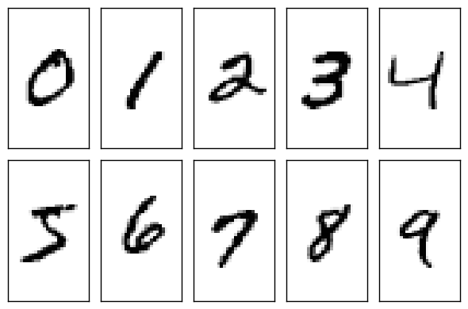
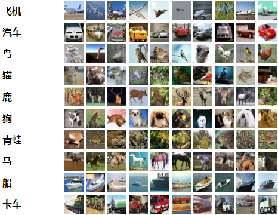

## MNIST

> MNIST 数据集来自美国国家标准与技术研究所, National Institute of Standards and Technology (NIST). 训练集 (training set) 由来自 250 个不同人手写的数字构成, 其中 50% 是高中学生, 50% 来自人口普查局 (the Census Bureau) 的工作人员. 测试集(test set) 也是同样比例的手写数字数据.

手写数字数据集，均为二值化图片

训练集：6000

测试集：1000

类别：10

每个样本尺寸：1@28*28

```python
from torchvision import datasets

# 必须将格式转换为Tensor，图片加载进来默认为PIL.Image Image
transform = transforms.Compose([transforms.ToTensor(),
                                 transforms.Normalize((0.1307, ), (0.3018, ))])
# 这里使其灰度值服从正态分布，结果有负数，但用cv2.imshow()依然可以输出

train_set = datasets.MNIST(root='../dataset/mnist', train=True, download=True,
                           transform=transform)
test_set = datasets.MNIST(root='../dataset/mnist', train=False, download=True,
                          transform=transform)

train_loader = DataLoader(train_set, shuffle=True, batch_size=batch_size)
test_loader = DataLoader(test_set, shuffle=True, batch_size=batch_size)
```

 


## CIFAR-10

> CIFAR-10数据集由10个类的60000个32x32彩色图像组成，每个类有6000个图像。有50000个训练图像和10000个测试图像。
> 数据集分为五个训练批次和一个测试批次，每个批次有10000个图像。测试批次包含来自每个类别的恰好1000个随机选择的图像。训练批次以随机顺序包含剩余图像，但一些训练批次可能包含来自一个类别的图像比另一个更多。总体来说，五个训练集之和包含来自每个类的正好5000张图像。

 