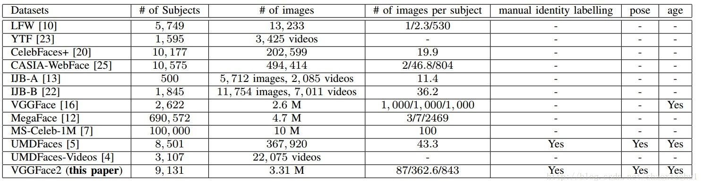

# 一般数据集

## MNIST

> MNIST 数据集来自美国国家标准与技术研究所, National Institute of Standards and Technology (NIST). 训练集 (training set) 由来自 250 个不同人手写的数字构成, 其中 50% 是高中学生, 50% 来自人口普查局 (the Census Bureau) 的工作人员. 测试集(test set) 也是同样比例的手写数字数据.

手写数字数据集，均为二值化图片

训练集：6000

测试集：1000

类别：10

每个样本尺寸：1@28*28

```python
from torchvision import datasets

# 必须将格式转换为Tensor，图片加载进来默认为PIL.Image Image
transform = transforms.Compose([transforms.ToTensor(),
                                 transforms.Normalize((0.1307, ), (0.3018, ))])
# 这里使其灰度值服从正态分布，结果有负数，但用cv2.imshow()依然可以输出

train_set = datasets.MNIST(root='../dataset/mnist', train=True, download=True,
                           transform=transform)
test_set = datasets.MNIST(root='../dataset/mnist', train=False, download=True,
                          transform=transform)

train_loader = DataLoader(train_set, shuffle=True, batch_size=batch_size)
test_loader = DataLoader(test_set, shuffle=True, batch_size=batch_size)
```

 


## CIFAR-10

> CIFAR-10数据集由10个类的60000个32x32彩色图像组成，每个类有6000个图像。有50000个训练图像和10000个测试图像。
> 数据集分为五个训练批次和一个测试批次，每个批次有10000个图像。测试批次包含来自每个类别的恰好1000个随机选择的图像。训练批次以随机顺序包含剩余图像，但一些训练批次可能包含来自一个类别的图像比另一个更多。总体来说，五个训练集之和包含来自每个类的正好5000张图像。

 


# 人脸数据集

 

## 常用训练集

### CASIA-WebFace

- Raw
  - subject：10575
  - images：494414
- Cleaned
  - subject：10575
  - images：455594


### VGGFace2

> VGGFace2 是一个大规模人脸识别数据，包含331万图片，9131个ID，平均图片个数为362.6。
>
> 该数据集是从谷歌中下载的，包含不同姿态、年龄、光照和背景的人脸图片，其中约有59.7%的男性。
>
> 除了身份信息之外，数据集还包括人脸框，5个关键点、以及估计的年龄和姿态。

### MS1MV2

> MS-Celeb-1M的另一个版本


### UMDFace

> 该数据集包含367920张人脸，分别类属于8501个事件类别。
>
> 提供的人脸信息包括，人脸框，人脸姿势，（yaw，pitch，roll），21个关键点，性别信息等。
>
> 由于图片尺度，方向等的问题，使得该数据集不适合做人脸检测的训练，适合做人脸识别


## 常用验证集

### LFW（Labeled Faces in the Wild）

> 5749个ID，13233张不同姿态、表情的图片，提供的人脸图片均来源于生活中的自然场景
>
> LFW数据集主要测试人脸识别的准确率，该数据库从中随机选择了6000对人脸组成了人脸辨识图片对，
>
> 其中3000对属于同一个人2张人脸照片，3000对属于不同的人每人1张人脸照片。
>
> 测试过程LFW给出一对照片，询问测试中的系统两张照片是不是同一个人，系统给出“是”或“否”的答案。
>
> 通过6000对人脸测试结果的系统答案与真实答案的比值可以得到人脸识别准确率。


### AgeDB-30

> AgeDB（Age Database ）包含
>
> 6000对 共440个ID，12240张不同姿态、表情、年龄、性别的图片。
>
> 同一个ID中，最小最大年龄分别为3岁和101岁，所有ID的平均年龄为49岁。
>
> 根据不同的年龄差把所有数据划分为4个年龄段（年龄差5岁、10岁、20岁以及30岁）。其中每个年龄段的数据包括300对正样本、300对负样本。
>
> 此处验证集使用年龄差为30的数据，命名为agedb30。


### CFP-FP

> 这个数据集由500个identity的约共7000张图片组成，这个数据集的特别之处在于对于每个人，它有10张正面图像和4张侧面图像，
>
> 这对于想要做侧脸识别的同学还是很有帮助的


### CALFW

> - id：5749
> - images:13233
> - pairs：6k
>
> 基于LFW数据集标注的跨年龄数据集，Cross-Age LFW (CALFW) database


### CPLFW

> - id：5749
> - images:13233
> - pairs：6k
>
> 基于LFW数据集标注的跨姿态数据集，Cross-Pose LFW (CPLFW) Database


## 常用测试集

### MegaFace


### IJB

> - IJB-A 全称为 IARPA Janus Benchmark-A face challenge， 由 NIST[美国国家标准与技术研究院]（National Institute of Standards and Technology）所提出，
>
>   该竞赛所提供的数据集包含 500 个对象的 5712 张静态人脸图像和 2085 个人脸视频帧。
>
> - IJB-B 由 IJB-A 迭代而来，
>
>   该竞赛所提供的数据集包含 1845 个对象的 11754 张人脸图像， 55026 个视频帧，7011 个视频，10044 张非人脸图像。
>
> - IJB-C 由 IJB-B 迭代而来，
>
>   该竞赛所提供的数据集包含 3531 个对象的 21294 张人脸图像， 117542 个视频帧，11779 个视频，10040 张非人脸图像。