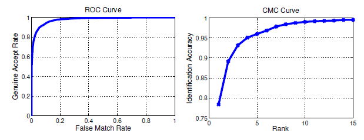

## CMC

- CMC曲线全称是Cumulative Match Characteristic (CMC) curve，也就是累积匹配特征曲线，同ROC曲线Receiver Operating Characteristic (ROC) curve一样，是模式识别系统，如人脸，指纹，虹膜等的重要评价指标，尤其是在生物特征识别系统中，一般同ROC曲线一起给出，能够综合评价出算法的好坏

CMC曲线综合反映了分类器的性能，它的评价指标与现在deep learning中常用的top1 err或top5 err评价指标一样的意思，不同的是这里Rank1 recognition rate表示的是正确率而不是错误率，两者的关系是

- Rank1识别率=1-top1 err

- Rank5识别率=1-top5 err

 

- CMC曲线是算一种top-k的击中概率，主要用来评估闭集中rank的正确率。举个很简单的例子，假如在人脸识别中，底库中有100个人，现在来了1个待识别的人脸（假如label为m1），与底库中的人脸比对后将底库中的人脸按照得分从高到低进行排序，我们发现：

    如果识别结果是m1、m2、m3、m4、m5……，则此时rank-1的正确率为100%；rank-2的正确率也为100%；rank-5的正确率也为100%；
    如果识别结果是m2、m1、m3、m4、m5……，则此时rank-1的正确率为0%；rank-2的正确率为100%；rank-5的正确率也为100%；
    如果识别结果是m2、m3、m4、m5、m1……，则此时rank-1的正确率为0%；rank-2的正确率为0%；rank-5的正确率为100%；

- 同理，当待识别的人脸集合有很多时，则采取取平均值的做法。例如待识别人脸有3个（假如label为m1，m2，m3），同样对每一个人脸都有一个从高到低的得分，

    比如人脸1结果为m1、m2、m3、m4、m5……，人脸2结果为m2、m1、m3、m4、m5……，人脸3结果m3、m1、m2、m4、m5……，则此时rank-1的正确率为（1+1+1）/3=100%；rank-2的正确率也为（1+1+1）/3=100%；rank-5的正确率也为（1+1+1）/3=100%；
    比如人脸1结果为m4、m2、m3、m5、m6……，人脸2结果为m1、m2、m3、m4、m5……，人脸3结果m3、m1、m2、m4、m5……，则此时rank-1的正确率为（0+0+1）/3=33.33%；rank-2的正确率为（0+1+1）/3=66.66%；rank-5的正确率也为（0+1+1）/3=66.66%；

## ROC

