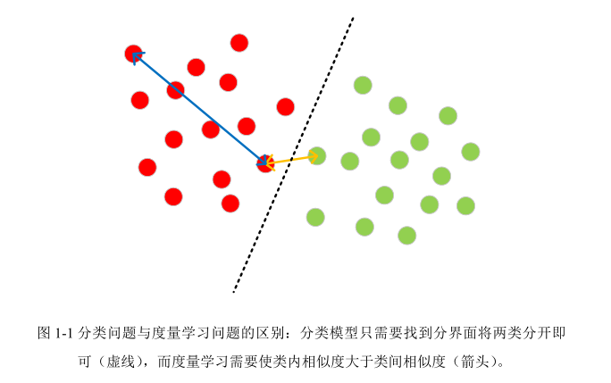
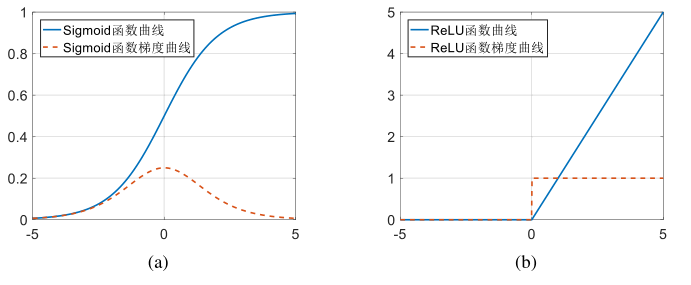
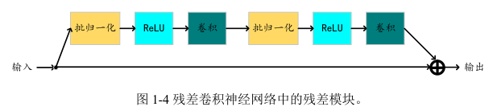

# 前言

## 符号

AM-Softmax：带有加性间隔的 Softmax 交叉熵损失函数

few-shot learning ：少量样本学习

zero-shot learning： 零样本学习

## 主要困难

> 人脸数据集有数据量大、身份多、各类别样本数量严重不均衡等特点；在设计损失函数时要综合考虑这几个特性；而针对这些问题来改进损失函数往往能带来可观的性能提升。
>
> - 身份数量多：基于分类的损失函数会遇到分类器矩阵多大、类内信号不充足的问题
> - 样本数量严重不均衡：模型更加倾向于样本数量多的类别，而一些样本数量少的类别所蕴含的模式甚至会被忽略

==人脸识别本质上是一个度量学习的任务==，度量学习与分类的区别在于度量学习进行的是`特征的比对`而分类是`寻找分界面`

​		如图1-1所示绘制了度量学习与分类问题的区别，从图上可以看出两类样本可以被一个分界面清晰地分开，但这个分界面的两侧的样本之间的距离（黄色箭头）可能会非常小，有可能会远小于类内样本之间的距离（蓝色箭头） 。由此可见，度量学习要求更高的类间间隔。

- 在分类问题中，往往也会要求训练类别之间拉开一定的间隔，然而这个间隔是为了提升模型的泛化能力、减小结构风险而引入的。

- 在度量学习中，即使不考虑泛化性能只在训练集上进行度量也仍旧需要非常大的间隔，而分类任务如果不考虑泛化误差，其间隔甚至可以为 0，这也就意味着度量学习是比分类更加困难的任务。

 

## 深度学习发展历程

- 感知器模型出现（现代神经网络模型的基础模型）

  - 由`Frank Rosenblatt`发明的单层二元分类器
  - 感知机权重是从样本中学习得到的，其学习方法被称为感知器学习算法
  - 感知器学习方法被证明在线性可分的情况下，它一定能找到两个类别的分界面

- 1970年沉寂

  - ==原因：==1969年 Minski 在他著写的关于感知器的书籍中提出了感知器可以完成与、或、非这类逻辑的分界面的求解，但对于异或和同或这种逻辑的分界面就无能为力了；单层的感知器作为一个线性模型，确实无法解决异或这种非线性问题。虽然多层的感知器可以解决异或问题，但无法用单层感知器的学习方法来学习

- 1986年反向传播算法出现，神经网络掀起第二次浪潮

  - 1986 年 RumelHeart 等人在 Nature 上发表了一篇使用反向传播算法学习神经网络权重的文章，该方法使得训练多层神经网络成为了可能。标志性网络：Lecun 教授提出的 LeNet网络；Schmidhuber 教授提出的 LSTM 网络
  - 这并不是反向传播算法的第一次提出，实际上早在 1963 年和 1969 年出版的多部著作中反向传播算法就已经被提出了，但由于当时信息传播较慢和研究者较少的缘故，该方法并未受到重视

- 2000年后神经网络再一次沉寂

  - ==原因：==因为当时使用的激活函数 Sigmoid 存在梯度弥散的问题，导致超过三层的神经网络就无法训练了，因此在 2000 年后神经网络的研究再一次陷入沉寂。当时人们把目光更多地投向了支持向量机这种凸模型中，而诟病神经网络这种非凸模型没有理论保证其能够收敛

- 2006年，Hinton教授提出限制玻尔兹曼机成功训练出多层神经网络，神经网络进入深度学习时代

  - 直到 2006 年，Hinton 教授在 Science 上发表文章，提出使用限制玻尔兹曼机来逐层无监督式地训练神经网络作为初始化，而后使用反向传播算法进行微调的策略，成功地训练出了多层神经网络，从此神经网络进入了深度学习时代

- 2009年，Lecun教授提出ReLU，解决了梯度弥散问题，使得第三次神经网络浪潮得以延续

  - 2006 年 Hinton 教授提出的方法虽然能训练超过 3 层的神经网络，但使用的逐层初始化的方式仍旧比较繁琐，没有从根本上解决梯度弥散现象。梯度弥散现象本质上是由于 Sigmoid 函数的梯度不稳定导致的，Sigmoid 函数在接近 0 处的导数较大，而两端的导数极小接近于 0，==如图(a)== 所示。这导致在训练初期整个网络在快速变化时一旦输入的幅度过大，则反向的梯度就会极小，此时再用梯度对权值进行更新带来的改变就会微乎其微，导致网络再也无法恢复

     

  - Sigmoid 函数是由大脑神经元的激活模型启发得到的，而人们至今对大脑神经元的工作原理也不甚
    清楚，所以如何修改人工神经网络的优化算法也无从谈起，人工神经网络受生物神经网络的启发而诞生，却也因为生物神经网络研究的停滞而受到限制

  - 幸而这一次神经网络的研究并未陷入沉寂就迎来了转机，在 2009 年 Lecun 教授的文章中提出了使用 ReLU 函数 max(x,0) 作为神经网络的激活函数，ReLU函数的梯度并不随着输入幅度的改变而改变，==如图(b)==所示。因此 ReLU 激活函数能够在训练的全程保持梯度幅度的稳定，这一小小的改动就解决了神经网络的
    梯度弥散问题，使得第三次神经网络浪潮得以延续下去

  - 然而在这段时间对于深度神经网络的研究仍然局限于几个研究组的小圈子中，大量学者并没有接受神经网络。直到 2012 年的 ImageNet 图像分类竞赛上，由Hinton 教授指导的 Alex Krizhevsky 博士使用一个深层卷积神经网络 AlexNet赢得了冠军，而且领先第二名超过 10 个百分点（15.3% 与 26.2%） ，这一巨大的提升
    轰动了学术界与工业界。在无可辩驳的优势面前，人们对于神经网络的研究进入了爆发期。

    > 以 AlexNet 为界限，深度学习被分成了两个时代，第一个时代是以限制玻尔兹曼机和自动编码机为代表的逐层预训练方法；第二个时代因为 ReLU 激活函数的出现，逐层预训练的方式被抛弃，改为整体直接训练来得到模型。所以又有人将后 AlexNet 时代称之为“第二波深度学习浪潮” 

- 后续：

  - 梯度弥散问题后续：
    - ReLU函数虽然解决了梯度弥散问题，但它仍存在神经元“凋亡”的问题，即如果输入全部为负数，则 ReLU 激活函数的输出全部为 0，此时反向的梯度也会全部为 0，从而使网络无法更新，这种情况比较罕见但仍旧存在。为了解决这一问题何恺明博士提出了参数化的 ReLU 函数，在输入小于 0 时激活函数输出 αx 而不
      是 0，这样即使输入全部为负数，神经网络仍然能获得梯度进行优化
    - 解决梯度弥散的另一种方式：批归一化（BN），它在每一层神经网络中都加入了归一化操作，使得输入激活函数的值均具备 0 均值和 1 标准差。这样不论训练多少层的神经网络，其梯度都如同训练单层神经网络一样不会产生明显的梯度弥散现象。使用该方法后，甚至连 Sigmoid 函数也能够在深层神经网络中继续使
      用。可惜 Sigmoid 函数的性能仍旧不如 ReLU 函数，所以现在使用最广的激活函数仍旧是 ReLU 函数

  - 何恺明在他的文章[14]中还发现了一个现象：深层神经网络在大概 20 层时就会达到性能的极限，这与“越深层的网络表达能力越强”的常识不符。何恺明等人针对这一问题提出了残差神经网络，残差神经网络基于一个基本的方法论：==如果第 N+1 层的神经网络是一个等值函数，那其性能应该至少不低于前 N 层构成的神经网络==。残差神经网络的每一个模块都由一个等值函数与一个普通的卷积、批处理、激活函数构成的非线性表达函数相加得到（如图1-4所示） 。这样由等值函数这一路可以保证深层的神经网络的性能至少不会退化，而非线性表达函数这一路则可以提升性能。

     

- 回顾神经网络几十年的发展，其中

  - 有三次热潮：感知器、反向传播、深度学习；

  - 也有两次沉寂：非线性问题、梯度弥散问题

