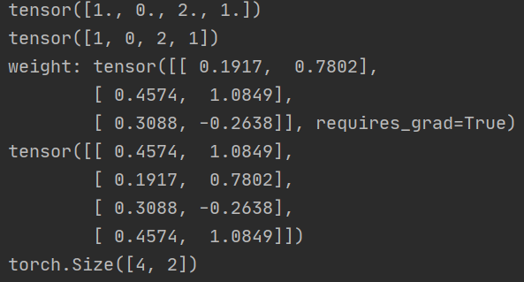
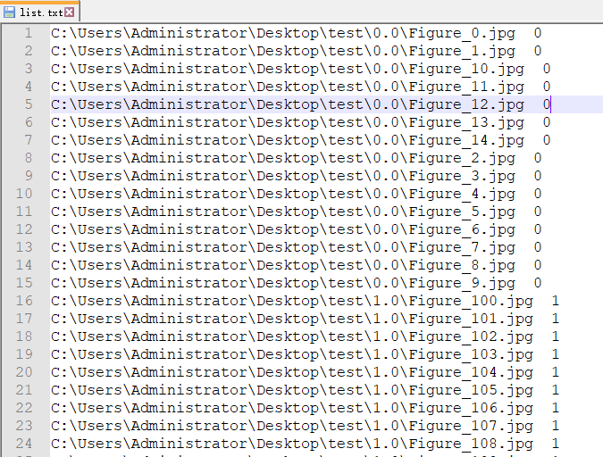
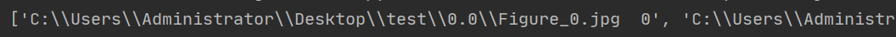
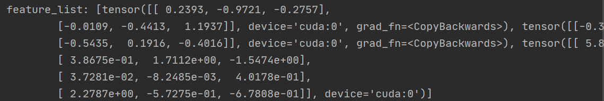
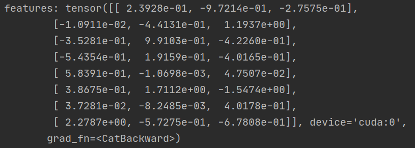
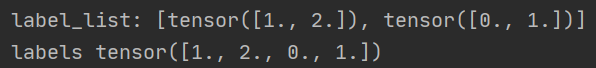
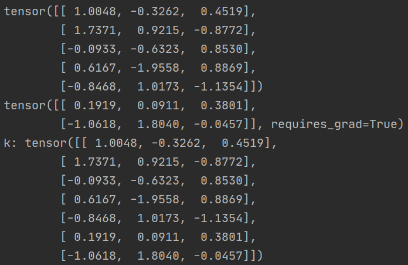
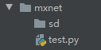

# 生成标签

> `lable = torch.randint(high=100, size=(10,1)).cuda()`
>
> - 原型：torch.randint(low=0, high, size)                   # size:(N,1)，表示生成N个样本的标签
>   - 生成形状为size的Tensor，其中每个元素取值为[0,100)之间的整数  （表示100个类）


---


# FC权重（the last）

> - 定义：`self.weight = torch.nn.Parameter(torch.FloatTensor(out_features, in_features))`
>   
>   - Parameter将一个不可训练的Tensor转换为可以训练的类型parameter，并且在参数优化时可以进行优化
>   
> - 初始化：`torch.nn.init.xavier_uniform_(self.weight)`
>   - 使之服从均匀分布
>   - 补：`torch.nn.init.xavier_normal_()` # 服从正态分布
>   
> - 求权重矩阵中属于某些类的权重向量
>
>   ```python
>   label = torch.Tensor([1, 0, 2, 1])
>   print(label)
>   print(label.long())
>   weight = torch.randn((3, 2), requires_grad=True)
>   print('weight:', weight)
>   print(weight.detach()[label.long()])
>   print(weight.detach()[label.long()].size()) 
>   ```
>
>    


---


# 文件的打开与关闭

打开如下文件并读取内容：

 


- > ```python
  >     with open(r'C:\Users\Administrator\Desktop\test\list.txt') as f:
  >         # read()函数返回一个整个文件内容(每行后含有'\n')组成的字符串
  >         # splitlines()将整个字符串按行'\n'分割，每行(不含结尾'\n')作为list的一个元素
  >         img_label_list = f.read().splitlines()
  >     print(img_label_list)
  > ```
  >
  >  
  >
  > - 不能使用`f.readlines()`，其虽然将每行作为list的一个元素，但包含了每行结尾的'\n'
  > - 使用with 方式打开文件不用显示关闭文件，默认只读

- > 使用：`f = open(r'C:\Users\Administrator\Desktop\test\list.txt')`
  >
  > - f的方法和上面with方法中的f对象一样；默认只读
  > - 使用完需要显式`f.close()`关闭文件


---

# torch.nn.functional 

> ```python
> import torch.nn.functional as F
> 
> - F.normalize(x): 若x为向量，则对其进行L2归一化；若x为矩阵，则将每一行视为一个向量，对每个向量进                     行L2归一化   [x,y]  -> [x/sprt(x^2+y^2),y/sqrt(x^2+y^2)]
> - F.linear(x, weight, bias=None): y = x * weight^T(矩阵乘法) + bias
> ```
>
> 


----


#  torch

- torch.zeros(shape)

  - > one_hot = torch.zeros(cosine.size(), device='cuda')   # 若想使得结果在GPU上，必须添加device属性
    >
    > one_hot.scatter_(1, label.view(-1, 1).long(), 1)   # 完成标签的One-Hot编码 
    >
    > - 若label内容都为torch.int类型，则不用加long()方法

- torch.zeros_like(x)

  - > 参数为具体的数据，若该数据在GPU上，则产生的同样形状的 零Tensor仍在GPU上

- torch.diag(input,diagonal=0,out=None)

  - > 如果input为一个1D张量(向量)，则返回以该张量为对角线的2D方阵
    >
    > 如果input为一个2D张量(矩阵)，则返回以该矩阵的对角线组成的1D张量

  - diagonal = 0：主对角线

  - diagonal > 0：主对角线之上

  - diagonal < 0：主对角线之下

  - > 求每个样本所对应的cos值：`cos = torch.diag(cosine.mm(one_hot.t()))`
    >
    > - 设2个样本，3个类，则由 cosine = F.linear(F.normalize(input), F.normalize(weight))得到 2*3的矩阵
    > - one_hot.t()为标签的独热编码矩阵的转置，形状为 3*2
    > - mm()为矩阵的乘法，矩阵相乘后结果为2*2，对角线恰好为每个样本所对应的cos值

- torch.where(条件, a, b)

  - 根据条件合并两个Tensor，若条件满足，使用a中对应元素，若条件不满足，使用b中元素

  - > c = torch.where(条件, a, b)  # 条件为Tensor，形状与a,b相同；内容为bool
    >
    > - 若两个Tensor形状相同，内容均为bool值，则两个Tensor直接可以使用& | 表示逻辑运算
  
- torch.cat( , dim)

  - > ```python
    >   feature_list = [] 
    >   batch_feature = torch.randn((2, 3), requires_grad=True).cuda()
    >   batch_feature2 = torch.randn((2, 3), requires_grad=True).cuda()
    >   batch_feature3 = torch.randn((4, 3), requires_grad=False).cuda()
    > 
    >   feature_list.append(batch_feature)
    >   feature_list.append(batch_feature2)
    >   feature_list.append(batch_feature3.detach()
    >   print('feature_list:', feature_list)  # [ [2,3], [2,3], [4,3]]
    >   
    >   features = torch.cat(feature_list, dim=0)
    >   print('features:', features)  # [2+2+4,3]
    >   
    > ```
    >
    > 
    >
    > 
  
  - > ```python
    > label_list = []
    > label = torch.Tensor([1, 2])
    > label2 = torch.Tensor([0, 1])
    > 
    >  label_list.append(label)
    >  label_list.append(label2)
    >  print('label_list:', label_list)  # [ [2], [2]]
    >  labels = torch.cat(label_list, dim=0)
    >  print('labels', labels)  # [2+2]
    > ```
    >
    >  
  
  - > ```python
    > # 快速合并两个Tensor
    > features = torch.randn((5, 3))
    > t = torch.randn((2, 3), requires_grad=True)
    > print(features)  # [5,3]
    > print(t) # [2,3]
    > k = torch.cat((features, t.detach()), dim=0)
    > print('k:', k)  # [5+2,3]
    > ```
    >
    > 
  
- torch.chunk()

  - > 作用：将Tensor切分成N份，放到一个元组中
    >
    > ```python
    > features = torch.randn((5, 3))
    > print(features.chunk(2, 0))  # ([3,3],[2,3]) 等价于 torch.chunk(features,2,dim=0)
    > print(type(features.chunk(2, 0))) # tuple
    > print(list(features.chunk(2, 0)))  # [[3,3],[2,3]]
    > print(type(list(features.chunk(2, 0)))) # list
    > ```
    >
    >  

- torch.norm(,dim)

  - > 作用：求Tensor的二范数，结果为一个1D张量
    >
    > ```python
    > features = torch.randn((2, 2))
    > norm = torch.norm(features, dim=1)  # dim=1表示按行求范数
    > print(norm)  # tensor([0.5043, 0.8691])
    > ```


---

# numpy

## 从正态分布取样

> `data = np.random.normal(loc=0, scale=1,size=100)`
>
> - 从均值为0，方差为1的正态分布中取100个样本


## 高斯混合模型使用

> ```python
> from sklearn.mixture import GaussianMixture
> 
> # 生成数据
> data1 = np.random.normal(loc=-0.2, scale=0.2, size=70000)
> data2 = np.random.normal(loc=0.7, scale=0.2, size=70000)
> data = np.hstack((data1, data2)) # 将两组数组组合在一起
> 
> gmm = GaussianMixture(n_components=2) #定义模型(该模型由2个高斯模型叠加而成)
> gmm.fit(data.reshape(-1, 1)) #根据数据拟合模型参数
> means = gmm.means_  # 两个高斯模型分别的均值
> means = np.sort(means, axis=0)  # 排序
> print('最大的均值:', means[1][0])
> ```


## 保存数据

> `np.save(os.path.join(hist_save_dir, 'data'), data)`
>
> - 生成一个扩展名为npy的文件
> - 该文件的读取：`data = np.load(路径)`


## 从指定范围获取N个随机数

> 使用 `np.random.choice(a, size=1, replace=True)`
>
> - a：整数或者1D数组（list,tuple,ndarray,...），整数a表示范围在[0, a)之间。
> - size=1：默认只获取一个随机数
> - replace=True：可以获取相同的数字

- > ```python
  > k = np.random.choice(2) #在[0, 2)之间获取一个整数  ，不是0 就是1。可以用作50%概率条件
  > k = np.random.choice([1,2,3,5],2,replace=False) # 在这几个数字中获取两个，且两个数字要不同
  > ```

---


# OS

## 生成目录

> ```python
> import os
> from datetime import datetime
> 
> # 使用os.path.join将两个字符串拼接，形成目录路径(join会在两个字符串之间用‘\’连接)
> # .\histogrampics\20200226_225240
> hist_save_dir = os.path.join('.\histogrampics',datetime.now().strftime('%Y%m%d_%H%M%S'))
> 
> if not os.path.exists(hist_save_dir):  如果目录不存在就生成该目录
>   os.makedirs(hist_save_dir)
> ```
>
> - os.makedirs()：可生成任何层次的目录
> - os.mkdir()：只能生成一层目录
>   - 如过histogrampics目录不存在，则相当于生成两级目录，此时使用mkdir将会报错
>
> 关于 `os.path.join(a,b)`补充：
>
> - 若b这个路径前缀为1个字符+1个冒号，即类似`C:	`，则a这个不经不会拼接到b上，拼接结果为b本身


##  os.listdir('路径')

> 作用：将该目录下一级的目录名，文件名放到list返回，若该目录为空，则返回 []。用来根据数据集构建其对应的list文件
>
> ```python
> path = r'./mxnet'
> path2 = r't'    # t为一个空目录
> print(os.listdir(path))   # ['test.py','sd']
> print(os.listdir(path2))  # []
> if os.listdir(path2):   # [] 用作判断条件等价于False
>     print(123)
> ```
>
>  


---

# matplotlib

- 保存图片：`plt.savefig(os.path.join(目录路径, 'pic.jpg'))` `plt.close()`
- 绘制直方图：`plt.hist(data, bins=200)`  `plt.show()`
  - bins表示将data按照值大小平均分成200个组，分别统计处于每个组范围内的频数


# collections

- deque    

  - > deque为双端队列
    >
    > 定义：`q = deque(maxlen=10)`   # 则该队列最多容纳10个元素，满10个之后，先进先出
    >
    > 将numpy内容添加到deque：`q.extend(a)`
    >
    > - ```python
    >   from collections import deque
    >   import numpy as np
    >   
    >   q = deque(maxlen=4)
    >   a = np.array([1,2,3])
    >   b = np.array([4,5,6])
    >   q.extend(a)  # [1,2,3]
    >   q.extend(b)  # [3,4,5,6]
    >   ```
    >
    > deque -> numpy：`n = np.array(q)`

  - deque数据可以直接使用matplotlib

    - `plt.hist(q, bins=5)`  `plt.show()`


---


