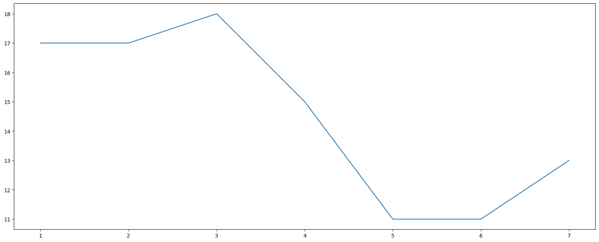

# 简介

matplotlib是Python的一个绘图库，专门用于开发2D图表，以渐进、交互式方式实现数据的可视化

为什么要学习matplotlib

- 能将数据进行可视化,更直观的呈现
- 使数据更加客观、更具说服力

例如下面两个图为数字展示和图形展示：

# 画图步骤

> matplotlib包下有一个pyplot模块，该模块包含了一系列类似于matlab的画图函数
>
> 我们使用该模块提供的函数进行图形的绘制

1. 导包：`import matplotlib.pyplot as plt`

2. 创建画布：` plt.figure()`

   - ```python
     plt.figure(figsize=(), dpi=)
         figsize:指定图的长宽,一般为20，8
         dpi:图像的清晰度
         返回fig对象
     ```

3. .绘制图像（折线图为例）：`plt.plot(x, y)`
   
   - x，y分别代表x轴数据，y轴数据
4. 显示图像：` plt.show()`

---

# 折线图绘制

**举例：展现上海一周的天气,比如从星期一到星期日的天气温度如下**

```python
import matplotlib.pyplot as plt

# 1.创建画布
plt.figure(figsize=(20, 8), dpi=100)

# 2.绘制折线图
plt.plot([1, 2, 3, 4, 5, 6 ,7], [17,17,18,15,11,11,13])

# 3.显示图像
plt.show()
```



---

# matplotlib图像结构

 