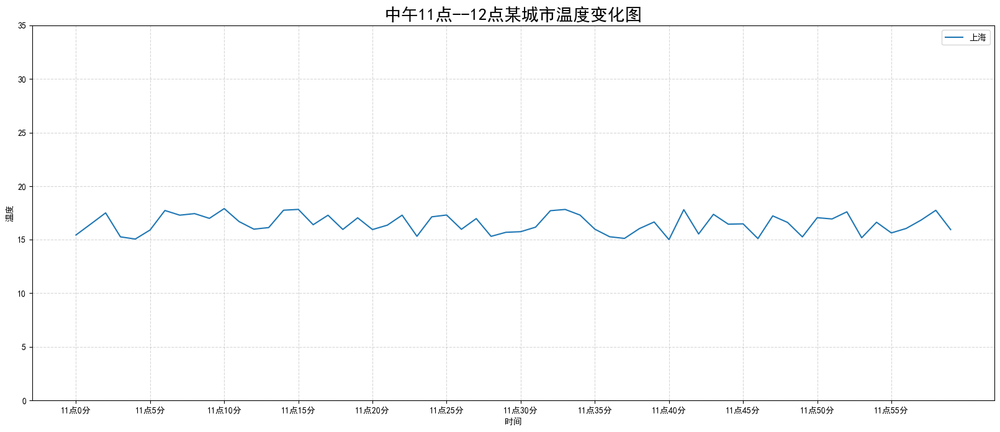
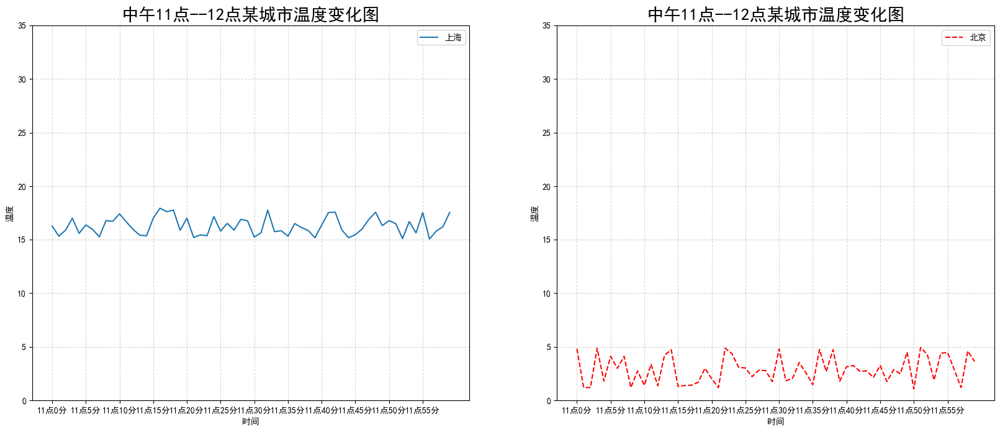

# 给图形添加辅助功能

## 自定义x，y轴刻度

> - `plt.xticks(x, **kwargs)`
>   - x：x轴的刻度值范围
>   - **kwargs：可有可无的额外参数，一般为刻度标签
>   - 注：刻度标签会覆盖上述的刻度值，但只是表面覆盖而已，真实值还是这些刻度值
> - `plt.yticks(y, **kwargs)`
>   - y：y轴的刻度值范围
> - `plt.xlim((-3,2))`
>   - 设置x轴刻度取值范围
> - `plt.ylim(-1,2)`
>
>   - 设置y轴刻度取值范围
>
> **这四个方法在绘图函数`plt.plot()`之前之后使用都可以**

> 当刻度标签中存在中文时，需要添加如下代码：
>
> ```python
> from pylab import mpl
> # 设置显示中文字体
> mpl.rcParams["font.sans-serif"] = ["SimHei"]
> # 设置正常显示符号
> mpl.rcParams["axes.unicode_minus"] = False
> ```

## 添加网格显示

`plt.grid(True, linestyle='--', alpha=0.5)`


## 添加X,Y轴标签和标题

```python
plt.xlabel("时间")
plt.ylabel("温度")
plt.title("中午11点0分到12点之间的温度变化图示", fontsize=20)
```


## 设置图例

- 注意：如果只在`plt.plot()`中设置label还不能最终显示出图例，还需要通过`plt.legend()`将图例显示出来。

- ```python
  # 绘制折线图
  plt.plot(x, y_shanghai, label="上海")
  # 显示图例
  plt.legend(loc="best")  #等价于loc=0
  ```

| Location String | Location Code |
| --------------- | ------------- |
| 'best'          | 0             |
| 'upper right'   | 1             |
| 'upper left'    | 2             |
| 'lower left'    | 3             |
| 'lower right'   | 4             |
| 'right'         | 5             |
| 'center left'   | 6             |
| 'center right'  | 7             |
| 'lower center'  | 8             |
| 'upper center'  | 9             |
| 'center'        | 10            |


## 图像保存

```python
# 保存图片到指定路径
plt.savefig("test.png")   #该方法在显示图片之前使用
```


## 完整代码

> 以折线图为例

```python
import matplotlib.pyplot as plt
import random
from pylab import mpl

# 设置显示中文字体
mpl.rcParams["font.sans-serif"] = ["SimHei"]
# 设置正常显示符号
mpl.rcParams["axes.unicode_minus"] = False

# 0.准备数据
x = range(60)
y_shanghai = [random.uniform(15, 18) for i in x]   #uniform()返回[15,18]之间的1个实数

# 1.创建画布
plt.figure(figsize=(20, 8), dpi=100)

# 2.绘制图像
plt.plot(x, y_shanghai, label="上海")

# 2.1 添加x,y轴刻度
# 构造x,y轴刻度标签
x_ticks_label = ["11点{}分".format(i) for i in x]
y_ticks = range(40)

# 刻度显示
plt.xticks(x[::5], x_ticks_label[::5])
plt.yticks(y_ticks[::5])

# 2.2 添加网格显示
plt.grid(True, linestyle="--", alpha=0.5)

# 2.3 添加描述信息
plt.xlabel("时间")
plt.ylabel("温度")
plt.title("中午11点--12点某城市温度变化图", fontsize=20)

# 显示图例
plt.legend(loc="best")

# 2.4 图像保存
plt.savefig("./test.png")

# 3.图像显示
plt.show()
```




# 一个坐标系绘制多个图像

> 多次使用plot函数即可


# 多个坐标系绘制 

> 使用`plt.subplots`(面向对象的画图方法)
>
> - `matplotlib.pyplot.subplots(nrows=1, ncols=1, **fig_kw) `创建一个带有多个axes(坐标系/绘图区)的图
>
> ```
> Parameters:    
> 
> nrows, ncols : 设置有几行几列坐标系
>     int, optional, default: 1, Number of rows/columns of the subplot grid.
> 
> Returns:    
> fig : 图对象
> axes : 返回相应数量的坐标系
> 
> 设置刻度，标题等方法不同：
>     set_xticks
>     set_yticks
>     set_xlabel
>     set_ylabel
> ```


## 完整代码

```python
#我们想要将上海和北京的天气图显示在同一个图的不同坐标系当中
# 0.准备数据
x = range(60)
y_shanghai = [random.uniform(15, 18) for i in x]
y_beijing = [random.uniform(1, 5) for i in x]

# 1.创建画布
# plt.figure(figsize=(20, 8), dpi=100)
fig, axes = plt.subplots(nrows=1, ncols=2, figsize=(20, 8), dpi=100)


# 2.绘制图像
# plt.plot(x, y_shanghai, label="上海")
# plt.plot(x, y_beijing, color="r", linestyle="--", label="北京")
axes[0].plot(x, y_shanghai, label="上海")
axes[1].plot(x, y_beijing, color="r", linestyle="--", label="北京")

# 2.1 添加x,y轴刻度
# 构造x,y轴刻度标签
x_ticks_label = ["11点{}分".format(i) for i in x]
y_ticks = range(40)

# 刻度显示
# plt.xticks(x[::5], x_ticks_label[::5])
# plt.yticks(y_ticks[::5])
axes[0].set_xticks(x[::5])
axes[0].set_yticks(y_ticks[::5])
axes[0].set_xticklabels(x_ticks_label[::5])
axes[1].set_xticks(x[::5])
axes[1].set_yticks(y_ticks[::5])
axes[1].set_xticklabels(x_ticks_label[::5])

# 2.2 添加网格显示
# plt.grid(True, linestyle="--", alpha=0.5)
axes[0].grid(True, linestyle="--", alpha=0.5)
axes[1].grid(True, linestyle="--", alpha=0.5)

# 2.3 添加描述信息
# plt.xlabel("时间")
# plt.ylabel("温度")
# plt.title("中午11点--12点某城市温度变化图", fontsize=20)
axes[0].set_xlabel("时间")
axes[0].set_ylabel("温度")
axes[0].set_title("中午11点--12点某城市温度变化图", fontsize=20)
axes[1].set_xlabel("时间")
axes[1].set_ylabel("温度")
axes[1].set_title("中午11点--12点某城市温度变化图", fontsize=20)

# # 2.4 图像保存
plt.savefig("./test.png")

# # 2.5 添加图例
# plt.legend(loc=0)
axes[0].legend(loc=0)
axes[1].legend(loc=0)


# 3.图像显示
plt.show()
```



## 补：设置图形风格

| 颜色字符 | 风格字符  |
| :------: | :-------: |
|  r 红色  |  - 实线   |
|  g 绿色  | - - 虚线  |
|  b 蓝色  | -. 点划线 |
|  w 白色  | : 点虚线  |
|  c 青色  |           |
|  m 洋红  |           |
|  y 黄色  |           |
|  k 黑色  |           |

