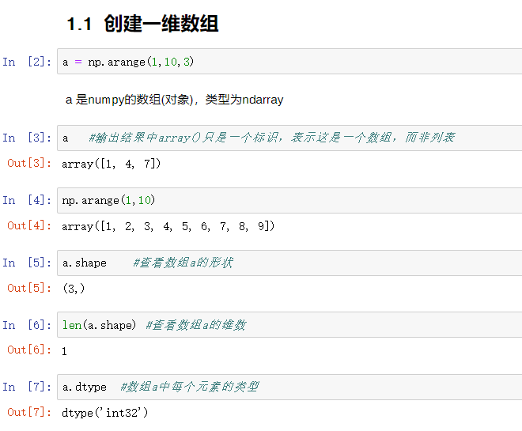
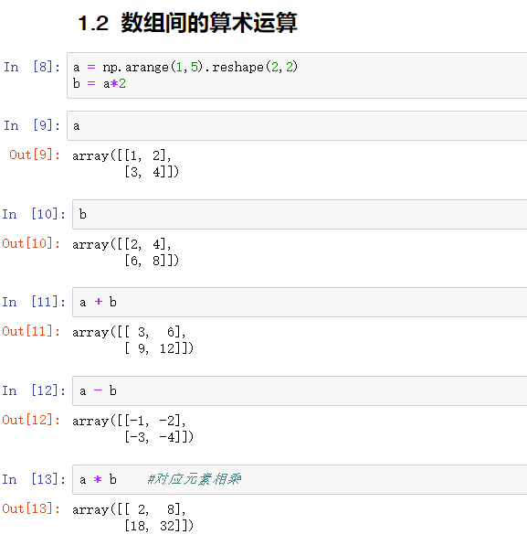
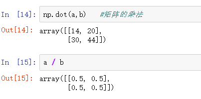

# 创建一维数组

 

# 数组间的算术运算

 

 

## Numpy的广播机制

> - 术语**广播**是指 NumPy 在算术运算期间处理不同形状的数组的能力。 对数组的算术运算通常在相应的元素上进行。 如果两个阵列具有完全相同的形状，则这些操作被无缝执行。
>
> - 如果两个数组的维数不相同，则元素到元素的操作是不可能的。 然而，在 NumPy 中仍然可以对形状不相似的数组进行操作，因为它拥有广播功能。
>
> - 较小的数组会**广播**到较大数组的大小，以便使它们的形状可兼容。
>
>   如果满足以下规则，可以进行广播：
>
>   - 如果两个数组在某个维度上的长度是相同的，或者其中一个数组在该维度上的长度为1，那么我们就说这两个数组在该维度上是**相容**的
>   - 如果两个数组在**所有维度**上都是**相容的**，它们就能使用广播

 