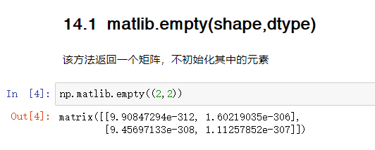
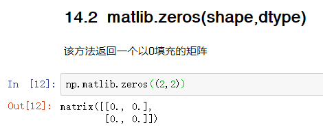
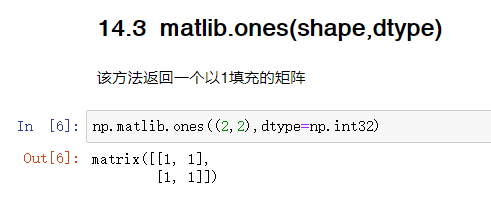
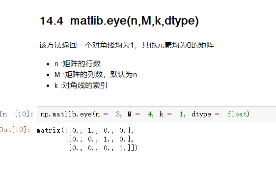
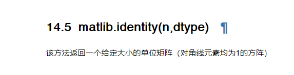
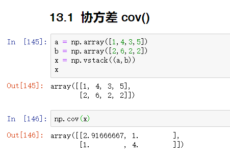
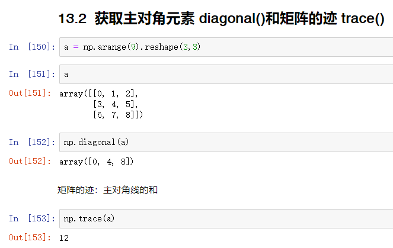
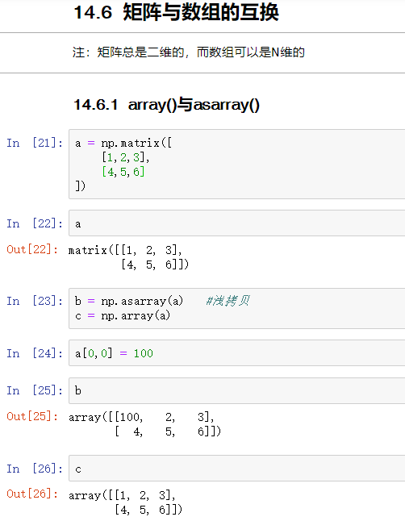

> NumPy 包包含一个 Matrix库numpy.matlib。此模块的函数返回矩阵而不是返回ndarray对象
>
> import numpy.matlib

# 矩阵的创建

## empty()

 

## zeros()

 

## ones()

 

## eye()

 

## identity()

 

# 协方差cov()

 

# 获取主对角元素与矩阵的迹

 

# 矩阵和数组的互换

 

 